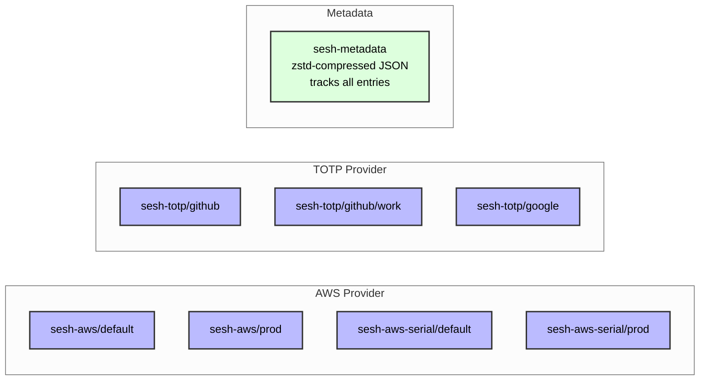

# sesh Architecture

This document describes the system architecture for sesh, a command-line credential management and authentication system.

## Contents

1. [Architectural Principles](#architectural-principles)
2. [Architectural Layers](#architectural-layers)
3. [Component Deep Dive](#component-deep-dive)
4. [Data Flow Architecture](#data-flow-architecture)
5. [Security Architecture](#security-architecture)
6. [Extensibility Model](#extensibility-model)
7. [Error Handling](#error-handling)
8. [Testing Strategy](#testing-strategy)
9. [Performance Design](#performance-design)

## Architectural Principles

The sesh architecture is based on four core design principles:

### 1. Plugin-Based Extensibility

Authentication providers are pluggable. The `ServiceProvider` interface defines a contract that all providers must fulfill. Providers are instantiated and registered with a central Registry at startup; only the selected provider performs work at runtime.

- New providers integrate without core system modifications
- Each provider can evolve independently
- Users only interact with providers they need
- Testing stays focused and isolated per provider

### 2. Component Isolation

Each component accesses only what it needs — nothing more. Keychain entries are scoped per-provider, secrets flow through stdin pipes, and memory is zeroed after use.

- Secrets are passed via stdin pipes, never as command arguments
- Subshell init files are written to temp files and cleaned up on exit
- Each provider manages its own secret storage namespace
- Secrets spend minimal time in memory

### 3. Terminal-Native Workflow

Terminal users shouldn't need to context-switch to graphical tools. Subshells provide isolated environments, clipboard integration handles quick pastes, and all operations are scriptable.

- No dependency on phones or browsers
- Reduces friction in automated workflows
- Scriptable from end to end

### 4. Interface-Driven Design

External dependencies are abstracted for testability. AWS CLI, Keychain, and TOTP generation sit behind formal interfaces with mock implementations. Other dependencies (clipboard, QR scanning, command execution) use replaceable package-level variables (`var execCommand = exec.Command`) for the same purpose.

- Unit tests can mock any external system
- Implementations can be swapped (e.g., different keychain backends)
- Code stays loosely coupled

## Architectural Layers

The architecture follows a strict layering model where dependencies flow downward:

```
┌─────────────────┐     ┌──────────────────┐     ┌─────────────────┐
│   CLI Layer     │────▶│   Core Layer     │────▶│ Provider Layer  │
│ sesh/cmd/sesh/  │     │ internal/        │     │ internal/       │
│                 │     │                  │     │   provider/     │
│ • Flag parsing  │     │ • Registry       │     │ • AWS Provider  │
│ • User I/O      │     │ • Setup Service  │     │ • TOTP Provider │
│ • Subshell mgmt │     │                  │     │ • Future...     │
└─────────────────┘     └──────────────────┘     └─────────────────┘
         │                       │                         │
         └───────────────────────┴─────────────────────────┘
                                 │
                    ┌────────────▼────────────┐
                    │   Infrastructure Layer  │
                    │      internal/          │
                    │                         │
                    │ • Keychain (secrets)    │
                    │ • TOTP generation       │
                    │ • Secure memory         │
                    │ • Clipboard             │
                    │ • QR code scanning      │
                    │ • AWS CLI integration   │
                    └─────────────────────────┘
```

### Layer Responsibilities

**CLI Layer**: User interaction handling
- Separates business logic from presentation
- Enables workflow-focused testing

**Core Layer**: Provider orchestration
- Isolates provider-specific logic
- Ensures consistent provider behavior
- Shared infrastructure (keychain, TOTP, secure memory) available to all providers

**Provider Layer**: Authentication modules
- Contains provider dependencies
- Implements provider-specific strategies
- Enables independent development

**Infrastructure Layer**: Shared utilities
- Eliminates code duplication
- Centralizes security operations
- Provides consistent behavior

## Component Deep Dive

### CLI Layer

**Design Decisions:**

1. **Separation of Concerns**:
   - `main.go` extracts the service name, delegates flag parsing, and dispatches to app methods
   - `app.go` manages application lifecycle and dependencies
   - `app_subshell.go` isolates subshell complexity

2. **Dependency Injection**:
   ```go
   func NewDefaultApp(versionInfo VersionInfo) *App
   ```
   The constructor creates all dependencies (keychain, TOTP, AWS services) internally and wires them together. Tests can substitute any dependency.

3. **Provider Registration**:
   ```go
   registry := provider.NewRegistry()
   registry.RegisterProvider(awsProvider.NewProvider(awsSvc, kc, totpSvc))
   registry.RegisterProvider(totpProvider.NewProvider(kc, totpSvc))
   ```
   Centralized registration in `NewDefaultApp` makes provider discovery explicit and debuggable.

### Provider Interface Design

The `ServiceProvider` interface provides the extensibility mechanism:

```go
type ServiceProvider interface {
    // Identity - Who are you?
    Name() string
    Description() string
    
    // Configuration - What do you need?
    SetupFlags(fs FlagSet) error
    GetSetupHandler() interface{}
    
    // Operations - What can you do?
    GetCredentials() (Credentials, error)
    GetClipboardValue() (Credentials, error)
    ListEntries() ([]ProviderEntry, error)
    DeleteEntry(id string) error
    
    // Validation - Are we ready?
    ValidateRequest() error
    
    // Help - How do you work?
    GetFlagInfo() []FlagInfo
}
```

**Interface Design Rationale**

1. **Minimal Surface Area**: Each method has a single, defined purpose.

2. **Lifecycle Management**: Credential retrieval follows a defined flow:
   - Setup flags → Validate request → Get credentials (or clipboard value)
   - List and delete operations skip validation and call providers directly

3. **Output Mode Abstraction**: Separate methods for `GetCredentials()` and `GetClipboardValue()` eliminate conditional logic within providers.

4. **Self-Documenting**: `GetFlagInfo()` makes providers introspectable, enabling dynamic help generation.

**Optional Interface Pattern**

Since subshell functionality is optional, we use interface composition:

```go
type SubshellProvider interface {
    NewSubshellConfig(creds Credentials) interface{}
}
```

This pattern (following Go's composition model) provides:
- Capability declaration via interfaces
- Runtime feature discovery
- Non-breaking capability additions

### Infrastructure Components

Infrastructure components implement the following security controls:

#### Keychain Integration

**macOS Keychain Integration**
- OS-managed encryption (AES-256)
- Process-level access control via `-T` flag
- User-transparent authorization dialogs

Binary path restrictions in practice
```bash
security add-generic-password ... -T /path/to/sesh
```
This means even if another process knows the service name, it cannot access the secret.

**Keychain Data Model**

All keychain entries follow the `keyformat` convention. Metadata for all entries is stored in a single zstd-compressed blob:



Each entry is a keychain item keyed by `{namespace}/{segments}` (built by `keyformat.Build`, parsed by `keyformat.Parse`). The account field is the OS username. AWS stores both a TOTP secret (`sesh-aws/{profile}`) and an MFA serial (`sesh-aws-serial/{profile}`) per profile.

#### TOTP Generation

**Dual Code Generation**
```go
// Current + Next code generation in a single call
currentCode, nextCode, err := p.totp.GenerateConsecutiveCodesBytes(secret)
```
Generates both current and next codes to handle the transition between 30-second TOTP windows.

#### Memory Management

Go's garbage collector prevents true secure erasure, but we reduce the exposure window:

1. Use `[]byte` over `string` for mutability
2. Zero immediately after use
3. Use `runtime.KeepAlive()` to prevent the compiler from optimizing away the zeroing
4. Pass secrets via stdin, not command arguments

#### Subshell Implementation

**Design**:
1. Custom prompt for visual indication
2. `SESH_ACTIVE` check prevents nesting
3. Automatic cleanup on exit
4. Built-in helper functions

**Subshell Advantages**
- Provides explicit credential lifecycle management
- Prevents pollution of main shell environment
- Provides clear entry/exit points for audit logging
- Visual indicators reduce operational security errors

### Setup System

**Design Principles:**

1. **Progressive Disclosure**: QR scanning with manual entry fallback
2. **Immediate Validation**: Verify secrets before storing
3. **Test Before Trust**: Generate test codes for verification

```go
type SetupHandler interface {
    ServiceName() string
    Setup() error
}
```

**Handler Responsibilities**:
- Service-specific secret formats
- Validation rules
- Test code generation
- User guidance

**The Service Registry Pattern**:
```go
type SetupService interface {
    RegisterHandler(handler SetupHandler)
    SetupService(serviceName string) error
    GetAvailableServices() []string
}
```

This gives you:
- Handler discovery at runtime
- Consistent setup experience across providers
- Easy addition of new setup workflows

## Data Flow Architecture

AWS and TOTP follow different flows because AWS requires a network round-trip to STS to exchange a TOTP code for temporary credentials, while TOTP is purely local computation. Both flows retrieve secrets from Keychain via stdin and route output through the same secured channels (subshell or clipboard).

### AWS Authentication Flow

The mode decision happens in main.go *before* credential generation. Subshell and clipboard modes follow different code paths:

```
User ──► CLI ──► ValidateRequest
                      │
                      ├── Keychain: verify TOTP secret exists
                      └── Keychain: check MFA serial (warn if missing)
                      │
                ┌─────┴──────┐
                ▼            ▼
         -clip mode     default mode
                │            │
                ▼            ▼
        GetClipboardValue  GetCredentials
                │            │
                ▼            ├── Keychain (get MFA serial, fallback to aws iam)
           Keychain          ├── Keychain (get TOTP secret)
          (get TOTP          ├── TOTP Engine → generate current + next codes
           secret)           ├── AWS CLI (sts get-session-token)
                │            │   └── retries with next/future code on failure
           TOTP Engine       ├── Parse expiry, build env vars
                │            ▼
                ▼       NewSubshellConfig
          Copy code          │
         to clipboard   Launch subshell
                        (isolated env)
```

**Why it works this way:**

1. **Early branching**: Clipboard mode only generates a TOTP code — it never calls AWS STS. This avoids consuming the one-time code that the subshell path needs for authentication.

2. **AWS CLI delegation**: STS calls go through the `aws` CLI binary, inheriting region selection, profile configuration, and security updates without sesh needing the AWS SDK.

3. **Retry logic**: If AWS rejects a TOTP code (recently used, or near a time window boundary), GetCredentials automatically retries with the next code, then with a future window code.

### TOTP Data Flow

TOTP is simpler — no network calls, no subshell. The `-clip` and default paths share the same generation logic:

```
User ──► CLI ──► ValidateRequest
                      │
                      └── Keychain: verify secret exists
                      │
                ┌─────┴──────┐
                ▼            ▼
         -clip mode     default mode
                │            │
                ▼            ▼
        GetClipboardValue  GetCredentials
                │            │
         (both call generateTOTP internally)
                │
                ├── Keychain (get TOTP secret)
                ├── Defensive copy, zero original
                ├── TOTP Engine (RFC 6238)
                │   └── Generate current + next codes
                ├── Calculate seconds remaining in window
                ▼
         Return credentials
                │
         -clip: copy current code to clipboard via pbcopy
         default: print codes, suggest using -clip
```

**TOTP implementation details:**

1. **Stateless**: Only needs the secret and current timestamp — no network, no session state
2. **Dual codes**: Generates both current and next 30-second window codes
3. **Defensive memory**: Secret bytes are copied, original zeroed immediately, copy zeroed on return

## Security Architecture

### Security Layers

Each layer provides independent security measures:

1. **Storage Security**
   - **Threat**: Other processes reading secrets
   - **Defense**: Binary path restrictions (`-T` flag)
   - **Enforcement**: macOS Keychain access control subsystem

2. **Memory Security**
   - **Threat**: Memory dumps, swap files, cold boot attacks
   - **Defense**: Immediate zeroing, byte slice preference
   - **Limitation**: Go's GC constraints require mitigation strategies

3. **Process Security**
   - **Threat**: Secrets visible in `ps`, shell history, or logs
   - **Defense**: Stdin pipes for all secret transmission
   - **Security Principle**: Process arguments are public, stdin is private

4. **Session Security**
   - **Threat**: Credential leakage between sessions
   - **Defense**: Isolated subshells with automatic cleanup
   - **User Benefit**: Clear security boundaries

5. **Access Security**
   - **Threat**: Network interception, MITM attacks
   - **Defense**: No network code - delegate to AWS CLI
   - **Approach**: Delegate to established security implementations

### Trust Boundaries

Understanding where trust transitions occur:

```
User Input → [TRUST BOUNDARY] → sesh
    ↓
   sesh → [TRUST BOUNDARY] → macOS Keychain
    ↓
   sesh → [TRUST BOUNDARY] → AWS CLI
    ↓
AWS CLI → [TRUST BOUNDARY] → AWS APIs

Additional trust boundaries:
   sesh → [TRUST BOUNDARY] → Filesystem (temp shell init files, QR screenshot captures)
   sesh → [TRUST BOUNDARY] → Clipboard (pbcopy — visible to clipboard managers)
```

Each boundary represents:
- A potential attack surface
- A place where validation must occur
- A place for layered defenses

## Extensibility Model

### The Provider Contract

Adding a new provider looks like this:

```go
// 1. Define your provider
type YourProvider struct {
    keychain keychain.Provider
    // your fields
}

// 2. Implement ServiceProvider
func (p *YourProvider) GetCredentials() (Credentials, error) {
    // Provider-specific authentication logic
}

// 3. Register in NewDefaultApp (pass whatever dependencies your provider needs)
registry := provider.NewRegistry()
registry.RegisterProvider(yourprovider.NewProvider(kc, totpSvc))
```

Why this works:
- Clear contract (ServiceProvider interface)
- Dependencies are injected, not discovered
- Registration is explicit and centralized
- No global state for provider management (note: `keychain/metadata.go` uses `init()` to create zstd encoder/decoder singletons)

### Capability Evolution

The optional interface pattern is already in use — `SubshellDecider` and `SubshellProvider` are opt-in capabilities that providers implement only if needed:

```go
// Exists today: opt-in subshell support
type SubshellDecider interface {
    ShouldUseSubshell() bool
}
type SubshellProvider interface {
    NewSubshellConfig(creds Credentials) interface{}
}
```

This same pattern (from Go's io package) enables future capabilities I'm exploring without breaking existing providers:

```go
// Under consideration: audit logging for security-sensitive environments
type AuditableProvider interface {
    GetAuditEvents() []AuditEvent
}

// Under consideration: hardware security key support
type HardwareKeyProvider interface {
    RequiresHardwareKey() bool
    WaitForKeyTouch() error
}
```

The approach means:
- Existing providers keep working unchanged
- New capabilities are opt-in via interface composition
- Type assertions discover capabilities at runtime
- No versioning or migration burden

## Error Handling

### Error Design Principles

1. **Context Over Codes**: Users need to know *what went wrong* and *how to fix it*
2. **Wrap Don't Replace**: Preserve error chains for debugging
3. **User-Friendly Top Layer**: Technical details in logs, actionable messages to users

### Error Flow Architecture

```go
// Layer 1: Infrastructure (Technical)
return fmt.Errorf("keychain access failed: %w", err)
// Preserves full error context for debugging

// Layer 2: Provider (Contextual)  
return fmt.Errorf("failed to get AWS credentials for profile %s: %w", profile, err)
// Adds domain-specific context

// Layer 3: CLI (Actionable)
// Errors bubble up with full context; the CLI prints them directly
if err != nil {
    fmt.Fprintf(app.Stderr, "❌ %v\n", err)
    // Provider errors already include actionable hints, e.g.:
    // "no AWS entry found for profile 'prod'. Run 'sesh -service aws -setup' first"
}
```

### Error Message Examples

- Cryptic: `error: -25300`  
- Improved: `keychain access denied: no stored credentials for AWS profile 'prod'`  
- Optimal: `No AWS credentials found for profile 'prod'. Run: sesh -service aws -setup`

Errors become progressively more actionable as they flow up through layers.

## Testing Strategy

### Interface-Based Testing

Interface-based testing enables:
```go
type Provider interface {
    GetSessionToken(profile, serial string, code []byte) (Credentials, error)
    GetFirstMFADevice(profile string) (string, error)
}
```

- Millisecond execution
- Error path testing
- Parallel execution
- Offline operation

### The Test Helper Pattern

`MockExecCommand` uses Go's test binary as a mock process:

```go
func MockExecCommand(output string, err error) func(string, ...string) *exec.Cmd
```

The pattern uses the test binary itself as a mock process, eliminating:
- Shipping mock binaries
- Complex PATH manipulation  
- Platform-specific code

## Performance Design

sesh is a CLI tool — every invocation should feel instant. The design avoids unnecessary work:

- **Selective execution**: All providers are registered at startup, but only the selected provider's `SetupFlags` → `ValidateRequest` → `GetCredentials` chain runs. No eager initialization.
- **No framework overhead**: Direct macOS `security` command for keychain, Go's standard `flag` package for parsing, no logging framework in the hot path.
- **Compressed metadata**: Entry metadata is stored as a zstd-compressed blob in a single keychain entry, keeping keychain operations minimal regardless of how many entries exist.

The dominant cost in any sesh invocation is the keychain read (OS security check) and, for the AWS provider, the network round-trip to AWS STS.

## Implementation Details

### Directory Structure as Architecture

```
sesh/
├── sesh/cmd/sesh/         # CLI layer
├── internal/              # Core implementation
│   ├── provider/          # Plugin system
│   │   ├── interfaces.go  # Provider contract
│   │   ├── registry.go    # Provider discovery
│   │   └── */             # Provider implementations
│   ├── keychain/          # OS-level security
│   ├── secure/            # Memory security
│   └── */                 # Focused packages
└── docs/                  # Documentation
```

### Stakeholder Benefits

**Security Engineers:**
- Defined trust boundaries
- Explicit secret flow paths (keychain → provider → subshell/clipboard) — no implicit or hidden data paths
- Layered security implementation
- Transparent security model (no audit logging yet — see Capability Evolution)

**Developers:**
- Modular provider development
- Isolated testing capabilities
- Established patterns
- Explicit interface contracts

**Users:**
- Consistent cross-provider experience
- Predictable performance
- Default security configurations
- Extensibility support

## Summary

The architecture provides:

- **Extensibility** through the provider interface system
- **Security** via layered defense mechanisms
- **Simplicity** through clear separation of concerns
- **Performance** via efficient design patterns

The architecture scales linearly with provider count, supports addition of new authentication methods without breaking changes, and maintains security invariants as system complexity grows.
