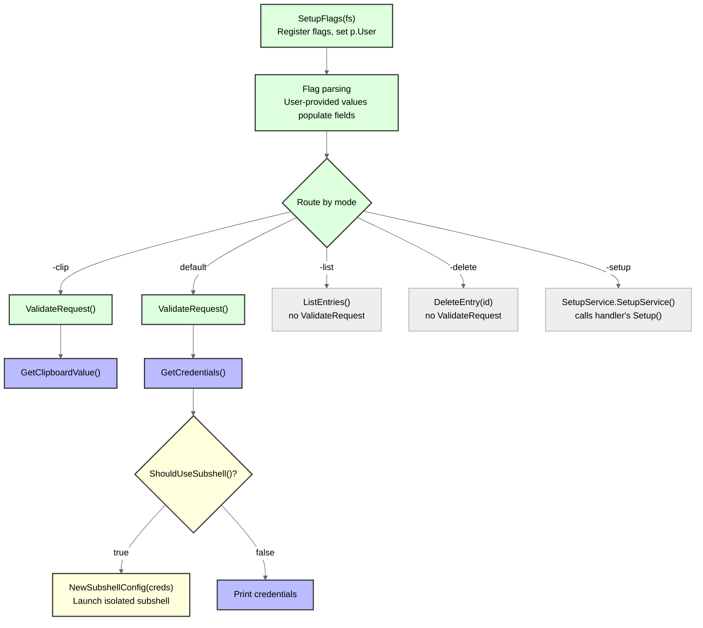

# Sesh Plugin Development Guide

This guide explains how to create new service providers for sesh. Whether you're adding support for a new cloud provider, a different authentication service, or any credential management system, this guide will walk you through the process.

## Table of Contents

1. [Architecture Overview](#architecture-overview)
2. [Creating a Basic Provider](#creating-a-basic-provider)
3. [Advanced Features](#advanced-features)
4. [Testing Your Provider](#testing-your-provider)
5. [Best Practices](#best-practices)
6. [Example: Minimal TOTP Provider](#example-minimal-totp-provider)

## Architecture Overview

Sesh uses a plugin-based architecture where each service (AWS, TOTP, etc.) is implemented as a provider. All providers must implement the `ServiceProvider` interface and register with the central Registry in `NewDefaultApp()`.

### Key Components

1. **ServiceProvider Interface**: Core contract all providers must implement
2. **Registry**: Manages provider registration and lookup
3. **Setup Handlers**: Handle initial configuration for each provider
4. **Keychain Integration**: Secure storage for secrets
5. **Shell Customizers**: Optional subshell support

> **First time here?** Skip to [Creating a Basic Provider](#creating-a-basic-provider) and refer back to these sections when you encounter unfamiliar concepts.

### Provider Lifecycle ([SVG](assets/provider-lifecycle.svg))

When a user runs sesh, the app calls your provider methods in this order:



Key points:
- `SetupFlags` runs for **all** modes — it's where you register flags and initialize `p.User`
- `ValidateRequest` only runs for credential and clipboard modes — list/delete/setup skip it
- `ShouldUseSubshell` and `NewSubshellConfig` are optional interfaces — only implement them if your provider needs a subshell

### Key Types

Types you'll work with (defined in `internal/provider/interfaces.go`):

```go
// Credentials is returned by GetCredentials() and GetClipboardValue()
type Credentials struct {
    Provider             string            // Your provider name
    Expiry               time.Time         // When credentials expire (used by subshell timer)
    Variables            map[string]string // Environment variables to set in subshell
    DisplayInfo          string            // Shown to the user (use FormatRegularDisplayInfo helper)
    CopyValue            string            // Value copied to clipboard (set by GetClipboardValue)
    ClipboardDescription string            // Short label for CopyValue (e.g., "TOTP code")
    MFAAuthenticated     bool              // True if backend accepted an MFA code
}

// ProviderEntry is returned by ListEntries()
type ProviderEntry struct {
    Name        string // Display name (e.g., "GitHub (work)")
    Description string // Human-readable description
    ID          string // Internal ID in "service:account" format, used by DeleteEntry()
}

// FlagInfo is returned by GetFlagInfo() for help text generation
type FlagInfo struct {
    Name        string // Flag name (e.g., "service-name")
    Type        string // "string", "bool", or "int"
    Description string // Help text
    Required    bool
}
```

### Embedded Helpers

Real providers embed two helper structs from the `provider` package. These are recommended but not strictly required — they handle common patterns that you'd otherwise implement yourself:

**`provider.Clock`** — Testable time. Provides `TimeNow()` (returns `time.Now()` by default, overridable in tests via the `Now` field) and `SecondsLeftInWindow()` (seconds remaining in the current 30-second TOTP window).

**`provider.KeyUser`** — Deferred OS user lookup. Has a `User` field (string) and an `EnsureUser() error` method that populates `User` on first call (no-op if already set). Initialize `User` in `SetupFlags` via `env.GetCurrentUser()`, and call `EnsureUser()` before keychain access as a safety net.

### Service Key Format (`keyformat` package)

All keychain service keys use `/` as the delimiter. Use `keyformat.Build` and `keyformat.Parse` — never construct keys by hand.

```go
// Build joins namespace + segments with /
// Returns error if any segment is empty or contains /
key, err := keyformat.Build("sesh-totp", "github")         // → "sesh-totp/github"
key, err = keyformat.Build("sesh-totp", "github", "work")  // → "sesh-totp/github/work"

// Parse splits a key back into segments
segments, err := keyformat.Parse("sesh-totp/github/work", "sesh-totp") // → ["github", "work"]
```

Define your service prefix constant in `internal/constants/constants.go` alongside the existing ones (`sesh-aws`, `sesh-totp`, `sesh-password`).

### Reference Files

When implementing a new provider, these are the files to study:

| File | Priority | What to learn |
|------|----------|--------------|
| `internal/provider/interfaces.go` | Essential | All interfaces and type definitions |
| `internal/provider/totp/provider.go` | Essential | Clean provider example (no subshell, clipboard-focused) |
| `internal/provider/password/provider.go` | Essential | Full provider with actions, prompts, JSON output, FTS search |
| `internal/provider/aws/provider.go` | Reference | Full provider with subshell, TOTP, retry logic |
| `internal/setup/setup.go` | When writing setup | Setup handler patterns |
| `internal/keychain/mocks/keychain_mock.go` | When writing tests | Pre-built mock for testing |
| `internal/keyformat/keyformat.go` | Reference | Key building/parsing |

## Creating a Basic Provider

### Step 1: Create Provider Structure

Create a new package under `internal/provider/yourservice/`:

```go
package yourservice

import (
    "errors"
    "fmt"

    "github.com/bashhack/sesh/internal/constants"
    "github.com/bashhack/sesh/internal/env"
    "github.com/bashhack/sesh/internal/keychain"
    "github.com/bashhack/sesh/internal/keyformat"
    "github.com/bashhack/sesh/internal/provider"
    "github.com/bashhack/sesh/internal/secure"
)

// Add your service prefix to internal/constants/constants.go, e.g.:
//   YourServicePrefix = "sesh-yourservice"
// Existing prefixes: sesh-aws, sesh-totp, sesh-password

type Provider struct {
    keychain keychain.Provider

    provider.Clock   // Embeds testable time and SecondsLeftInWindow()
    provider.KeyUser // Embeds lazy-initialized OS user lookup via EnsureUser()

    // Provider-specific fields
    serviceName string
    profile     string
}

func NewProvider(kc keychain.Provider) *Provider {
    return &Provider{
        keychain: kc,
    }
}
```

### Step 2: Implement Required Methods

#### Basic Identification

```go
func (p *Provider) Name() string {
    return "yourservice"
}

func (p *Provider) Description() string {
    return "Your Service - Brief description of what this provider does"
}
```

#### Flag Setup

```go
func (p *Provider) SetupFlags(fs provider.FlagSet) error {
    fs.StringVar(&p.serviceName, "service-name", "", "Name of the service")
    fs.StringVar(&p.profile, "profile", "", "Profile name (optional)")

    // Initialize the embedded KeyUser with the current OS user
    defaultKeyUser, err := env.GetCurrentUser()
    if err != nil {
        return fmt.Errorf("failed to get current user: %w", err)
    }
    p.User = defaultKeyUser
    return nil
}

func (p *Provider) GetFlagInfo() []provider.FlagInfo {
    return []provider.FlagInfo{
        {
            Name:        "service-name",
            Type:        "string",
            Description: "Name of the service",
            Required:    true,
        },
        {
            Name:        "profile",
            Type:        "string",
            Description: "Profile name for multiple accounts",
            Required:    false,
        },
    }
}
```

#### Validation

```go
func (p *Provider) ValidateRequest() error {
    if p.serviceName == "" {
        return fmt.Errorf("service name is required")
    }

    if err := p.EnsureUser(); err != nil {
        return err
    }

    // Build service key using keyformat (e.g., "sesh-yourservice/myapp")
    serviceKey, err := keyformat.Build(constants.YourServicePrefix, p.serviceName)
    if err != nil {
        return fmt.Errorf("failed to build service key: %w", err)
    }

    // Check if credentials exist in keychain
    secret, err := p.keychain.GetSecret(p.User, serviceKey)
    if err != nil {
        if !errors.Is(err, keychain.ErrNotFound) {
            return fmt.Errorf("failed to read secret from keychain: %w", err)
        }
        return fmt.Errorf("no stored credentials found for '%s'. Run: sesh -service yourservice -setup", p.serviceName)
    }
    secure.SecureZeroBytes(secret)

    return nil
}
```

#### Credential Generation

```go
func (p *Provider) GetCredentials() (provider.Credentials, error) {
    if err := p.EnsureUser(); err != nil {
        return provider.Credentials{}, err
    }

    serviceKey, err := keyformat.Build(constants.YourServicePrefix, p.serviceName)
    if err != nil {
        return provider.Credentials{}, fmt.Errorf("failed to build service key: %w", err)
    }

    secret, err := p.keychain.GetSecret(p.User, serviceKey)
    if err != nil {
        return provider.Credentials{}, fmt.Errorf("failed to retrieve secret for %s: %w", p.serviceName, err)
    }
    defer secure.SecureZeroBytes(secret)

    // Convert at the boundary where string is required (e.g., env vars)
    tokenStr := string(secret)
    defer secure.SecureZeroString(tokenStr)

    return provider.Credentials{
        Provider: p.Name(),
        Variables: map[string]string{
            "YOUR_SERVICE_TOKEN": tokenStr,
        },
        DisplayInfo: provider.FormatRegularDisplayInfo("credentials", p.serviceName),
    }, nil
}

// GetClipboardValue returns a value to copy to clipboard.
// For TOTP-based providers, use the CreateClipboardCredentials helper (see TOTP
// Integration below). For non-TOTP providers (passwords, API keys), set
// CopyValue and ClipboardDescription directly as shown here.
func (p *Provider) GetClipboardValue() (provider.Credentials, error) {
    if err := p.EnsureUser(); err != nil {
        return provider.Credentials{}, err
    }

    serviceKey, err := keyformat.Build(constants.YourServicePrefix, p.serviceName)
    if err != nil {
        return provider.Credentials{}, fmt.Errorf("failed to build service key: %w", err)
    }

    secret, err := p.keychain.GetSecret(p.User, serviceKey)
    if err != nil {
        return provider.Credentials{}, fmt.Errorf("failed to retrieve secret for %s: %w", p.serviceName, err)
    }
    defer secure.SecureZeroBytes(secret)

    return provider.Credentials{
        Provider:             p.Name(),
        CopyValue:            string(secret),
        ClipboardDescription: "secret",
    }, nil
}
```

#### Entry Management

```go
func (p *Provider) ListEntries() ([]provider.ProviderEntry, error) {
    entries, err := p.keychain.ListEntries(constants.YourServicePrefix)
    if err != nil {
        return nil, fmt.Errorf("failed to list entries: %w", err)
    }

    var result []provider.ProviderEntry
    for _, entry := range entries {
        result = append(result, provider.ProviderEntry{
            ID:          fmt.Sprintf("%s:%s", entry.Service, entry.Account),
            Name:        entry.Service,
            Description: entry.Description,
        })
    }

    return result, nil
}

func (p *Provider) DeleteEntry(id string) error {
    // Parse the entry ID (format: "service:account")
    service, account, err := provider.ParseEntryID(id)
    if err != nil {
        return fmt.Errorf("invalid entry ID: %w", err)
    }

    // Delete from keychain (metadata cleanup is handled internally)
    if err := p.keychain.DeleteEntry(account, service); err != nil {
        return fmt.Errorf("failed to delete entry: %w", err)
    }

    return nil
}
```

#### Setup Handler Reference

```go
func (p *Provider) GetSetupHandler() interface{} {
    return setup.NewYourServiceSetupHandler(p.keychain)
}
```

This returns an object implementing `setup.SetupHandler` (see Step 3 below). The `interface{}` return type allows the setup system to work without providers importing the setup package's concrete types.

### Step 3: Create Setup Handler

Create `internal/setup/yourservice_setup.go`.

> **Note:** The setup package defines `getCurrentUser` as a package-level variable (`var getCurrentUser = env.GetCurrentUser`) that can be swapped in tests. Your setup handler must live in `internal/setup/` to access `getCurrentUser` directly.

```go
import (
    "bufio"
    "fmt"
    "os"
    "strings"
    "syscall"

    "github.com/bashhack/sesh/internal/constants"
    "github.com/bashhack/sesh/internal/keychain"
    "github.com/bashhack/sesh/internal/keyformat"
    "github.com/bashhack/sesh/internal/secure"
    "golang.org/x/term"
)

type YourServiceSetupHandler struct {
    keychain keychain.Provider
}

func NewYourServiceSetupHandler(kc keychain.Provider) *YourServiceSetupHandler {
    return &YourServiceSetupHandler{keychain: kc}
}

func (h *YourServiceSetupHandler) ServiceName() string {
    return "yourservice"
}

func (h *YourServiceSetupHandler) Setup() error {
    fmt.Println("🔧 Setting up Your Service")
    
    // Get service name
    reader := bufio.NewReader(os.Stdin)
    fmt.Print("Enter service name: ")
    serviceName, err := reader.ReadString('\n')
    if err != nil {
        return fmt.Errorf("failed to read service name: %w", err)
    }
    serviceName = strings.TrimSpace(serviceName)

    // Get credentials (term.ReadPassword hides input)
    fmt.Print("Enter secret/token: ")
    secretBytes, err := term.ReadPassword(int(syscall.Stdin))
    if err != nil {
        return fmt.Errorf("failed to read secret: %w", err)
    }
    fmt.Println()
    defer secure.SecureZeroBytes(secretBytes)

    secretStr := string(secretBytes)
    defer secure.SecureZeroString(secretStr)

    // Build service key using keyformat (e.g., "sesh-yourservice/myapp")
    serviceKey, err := keyformat.Build(constants.YourServicePrefix, serviceName)
    if err != nil {
        return fmt.Errorf("failed to build service key: %w", err)
    }

    // Store in keychain (account is the OS user, service is the key)
    user, err := getCurrentUser()
    if err != nil {
        return fmt.Errorf("failed to get current user: %w", err)
    }
    if err := h.keychain.SetSecretString(user, serviceKey, secretStr); err != nil {
        return fmt.Errorf("failed to store credentials: %w", err)
    }

    // Set a human-readable description on the entry
    description := fmt.Sprintf("Your Service credentials for %s", serviceName)
    if err := h.keychain.SetDescription(serviceKey, user, description); err != nil {
        return fmt.Errorf("failed to store description: %w", err)
    }
    
    fmt.Printf("✅ Credentials stored for %s\n", serviceName)
    return nil
}
```

### Step 4: Register Provider

In `sesh/cmd/sesh/app.go`, add registration in `NewDefaultApp()`:

```go
func NewDefaultApp(versionInfo VersionInfo, kc keychain.Provider) *App {
    // kc is the credential store — passed in by main.go (keychain or SQLite)
    // ... existing setup ...

    registry := provider.NewRegistry()
    // ... existing providers ...
    registry.RegisterProvider(yourservice.NewProvider(kc)) // Add totpSvc if using TOTP integration

    setupSvc := setup.NewSetupService(kc)
    // ... existing handlers ...
    setupSvc.RegisterHandler(setup.NewYourServiceSetupHandler(kc))

    return &App{
        Registry:     registry,
        SetupService: setupSvc,
        // ...
    }
}
```

## Advanced Features

### Additional Capabilities

Providers can declare subshell preference by implementing the optional `SubshellDecider` interface:

```go
// SubshellDecider indicates whether this provider prefers subshell mode
// over printing credentials. Implement this to opt into subshell behavior.
func (p *Provider) ShouldUseSubshell() bool {
    return true // or false to default to print/clipboard mode
}
```

> **Important:** If `ShouldUseSubshell()` returns true, your provider **must** also implement `SubshellProvider` (below). If it doesn't, users will get a runtime error: "provider X does not support subshell customization."

### Subshell Support

To add subshell support, implement the `SubshellProvider` interface. Note that the real AWS customizer (`internal/aws/subshell.go`) is ~120 lines with expiry countdown, progress bars, and helper commands — the example below is intentionally simplified to show the required structure:

```go
func (p *Provider) NewSubshellConfig(creds *provider.Credentials) interface{} {
    return subshell.Config{
        ServiceName:     p.Name(),
        Variables:       creds.Variables,
        Expiry:          creds.Expiry,
        ShellCustomizer: &YourServiceShellCustomizer{},
    }
}

type YourServiceShellCustomizer struct{}

func (c *YourServiceShellCustomizer) GetZshInitScript() string {
    return `
        # Your service specific zsh initialization
        your_service_status() {
            echo "Your service is active"
        }
    `
}

func (c *YourServiceShellCustomizer) GetBashInitScript() string {
    return `
        # Your service specific bash initialization
        your_service_status() {
            echo "Your service is active"
        }
    `
}

func (c *YourServiceShellCustomizer) GetFallbackInitScript() string {
    return `
        # Fallback for shells other than bash/zsh
        your_service_status() {
            echo "Your service is active"
        }
    `
}

func (c *YourServiceShellCustomizer) GetPromptPrefix() string {
    return "yourservice"
}
```

### TOTP Integration

If your provider needs TOTP codes:

```go
type Provider struct {
    keychain keychain.Provider
    totp     totp.Provider  // Add TOTP dependency
    provider.Clock
    provider.KeyUser
    serviceName string
}

func (p *Provider) GetClipboardValue() (provider.Credentials, error) {
    if err := p.EnsureUser(); err != nil {
        return provider.Credentials{}, err
    }

    serviceKey, err := keyformat.Build(constants.YourServicePrefix, p.serviceName)
    if err != nil {
        return provider.Credentials{}, fmt.Errorf("failed to build service key: %w", err)
    }

    secret, err := p.keychain.GetSecret(p.User, serviceKey)
    if err != nil {
        return provider.Credentials{}, err
    }
    defer secure.SecureZeroBytes(secret)

    // Read stored TOTP params (algorithm, digits, period) — falls back to defaults if none stored
    params := p.loadTOTPParams(serviceKey)

    currentCode, nextCode, err := p.totp.GenerateConsecutiveCodesBytesWithParams(secret, params)
    if err != nil {
        return provider.Credentials{}, err
    }

    return provider.CreateClipboardCredentials(
        p.Name(), currentCode, nextCode, p.SecondsLeftInWindow(),
        "TOTP code", p.serviceName,
    ), nil
}

// loadTOTPParams reads stored params from the entry description (JSON).
func (p *Provider) loadTOTPParams(serviceKey string) totp.Params {
    entries, err := p.keychain.ListEntries(serviceKey)
    if err != nil || len(entries) == 0 {
        return totp.Params{}
    }
    return totp.ParseParams(entries[0].Description)
}
```

**TOTP Params**: When a QR code is scanned during setup, `totp.Params` (algorithm, digits, period, issuer) are extracted from the `otpauth://` URI and stored as JSON in the entry description. Most services use defaults (SHA1, 6 digits, 30 seconds), but some (e.g., Steam, certain enterprise SSO) use non-standard configurations. Providers that use `GenerateConsecutiveCodesBytesWithParams` will generate correct codes regardless.

## Testing Your Provider

### Unit Tests

Create `provider_test.go`:

```go
import (
    "testing"

    "github.com/bashhack/sesh/internal/keychain"
    keychainMocks "github.com/bashhack/sesh/internal/keychain/mocks"
)

func TestProvider_GetCredentials(t *testing.T) {
    tests := map[string]struct {
        serviceName string
        mockData    map[string][]byte
        wantErr     bool
        wantProvider string
    }{
        "valid credentials": {
            serviceName: "test",
            mockData: map[string][]byte{
                "sesh-yourservice/test": []byte("secret123"),
            },
            wantProvider: "yourservice",
        },
        "missing credentials": {
            serviceName: "nonexistent",
            mockData:    map[string][]byte{},
            wantErr:     true,
        },
    }

    for name, tc := range tests {
        t.Run(name, func(t *testing.T) {
            mockKC := &keychainMocks.MockProvider{
                GetSecretFunc: func(account, service string) ([]byte, error) {
                    key := service // service is the keyformat key
                    if data, ok := tc.mockData[key]; ok {
                        return data, nil
                    }
                    return nil, keychain.ErrNotFound
                },
            }
            p := NewProvider(mockKC)
            p.serviceName = tc.serviceName
            p.User = "testuser"

            creds, err := p.GetCredentials()
            if tc.wantErr {
                if err == nil {
                    t.Error("expected error, got nil")
                }
                return
            }
            if err != nil {
                t.Fatalf("unexpected error: %v", err)
            }
            if creds.Provider != tc.wantProvider {
                t.Errorf("got provider %q, want %q", creds.Provider, tc.wantProvider)
            }
            if creds.Variables["YOUR_SERVICE_TOKEN"] == "" {
                t.Error("expected non-empty YOUR_SERVICE_TOKEN")
            }
        })
    }
}
```

### Integration Tests

Test with actual keychain:

```go
func TestProvider_Integration(t *testing.T) {
    if testing.Short() {
        t.Skip("Skipping integration test")
    }
    
    kc := keychain.NewDefaultProvider()
    p := NewProvider(kc)
    
    // Test full workflow
    // ...
}
```

> **Mocking tip:** Use the pre-built `MockProvider` from `internal/keychain/mocks/` instead of writing your own. It has function fields for every `keychain.Provider` method:
> ```go
> import keychainMocks "github.com/bashhack/sesh/internal/keychain/mocks"
>
> mockKC := &keychainMocks.MockProvider{
>     GetSecretFunc: func(account, service string) ([]byte, error) {
>         return []byte("secret"), nil
>     },
> }
> ```

### Building and Running Tests

```bash
# Run all tests
make test

# Run tests for your provider only
go test ./internal/provider/yourservice/...

# Run fast tests (skip integration tests)
make test/short

# Full audit: test + lint + vet
make audit

# Build and run locally
make build && ./build/sesh -help
```

## Best Practices

### Security

1. **Always zero sensitive data**: Use `secure.SecureZeroBytes()`
2. **Work with byte slices**: Don't convert secrets to strings unnecessarily — use `GetSecret` (returns `[]byte`) over `GetSecretString` (returns `string`) for secrets
3. **Validate early**: Check credentials exist before expensive operations
4. **Clipboard awareness**: Clipboard contents persist after copy — sesh does not currently auto-clear the clipboard. For TOTP codes this is low-risk (codes expire within 30 seconds). The password provider copies secrets to clipboard when using `-clip`; consider the exposure window.

### User Experience

1. **Clear error messages**: Include setup instructions in errors
2. **Interactive setup**: Guide users through configuration
3. **Profile support**: Allow multiple accounts/configurations
4. **Consistent naming**: Follow existing patterns for flags and commands

### Code Organization

1. **Single responsibility**: Keep provider focused on one service
2. **Dependency injection**: Accept interfaces, not concrete types
3. **Error wrapping**: Use `fmt.Errorf` with `%w` for error context
4. **Constants**: Define prefixes and keys in constants package

## Example: Minimal TOTP Provider

Here's a complete minimal example for a generic TOTP service:

```go
package simple

import (
    "fmt"

    "github.com/bashhack/sesh/internal/env"
    "github.com/bashhack/sesh/internal/keychain"
    "github.com/bashhack/sesh/internal/keyformat"
    "github.com/bashhack/sesh/internal/provider"
    "github.com/bashhack/sesh/internal/secure"
    "github.com/bashhack/sesh/internal/totp"
)

// simpleServicePrefix would be defined in internal/constants/constants.go
const simpleServicePrefix = "sesh-simple"

type Provider struct {
    keychain    keychain.Provider
    totp        totp.Provider
    provider.Clock
    provider.KeyUser
    serviceName string
}

func NewProvider(kc keychain.Provider, totp totp.Provider) *Provider {
    return &Provider{
        keychain: kc,
        totp:     totp,
    }
}

func (p *Provider) Name() string { return "simple" }
func (p *Provider) Description() string { return "Simple TOTP provider" }

func (p *Provider) SetupFlags(fs provider.FlagSet) error {
    fs.StringVar(&p.serviceName, "service", "", "Service name")

    defaultKeyUser, err := env.GetCurrentUser()
    if err != nil {
        return fmt.Errorf("failed to get current user: %w", err)
    }
    p.User = defaultKeyUser
    return nil
}

func (p *Provider) GetFlagInfo() []provider.FlagInfo {
    return []provider.FlagInfo{
        {Name: "service", Type: "string", Description: "Service name", Required: true},
    }
}

func (p *Provider) ValidateRequest() error {
    if p.serviceName == "" {
        return fmt.Errorf("--service flag is required")
    }
    if err := p.EnsureUser(); err != nil {
        return err
    }
    return nil
}

func (p *Provider) GetCredentials() (provider.Credentials, error) {
    return provider.Credentials{}, fmt.Errorf("TOTP provider only supports clipboard mode: use -clip")
}

func (p *Provider) GetClipboardValue() (provider.Credentials, error) {
    if err := p.EnsureUser(); err != nil {
        return provider.Credentials{}, err
    }

    serviceKey, err := keyformat.Build(simpleServicePrefix, p.serviceName)
    if err != nil {
        return provider.Credentials{}, fmt.Errorf("failed to build service key: %w", err)
    }

    secret, err := p.keychain.GetSecret(p.User, serviceKey)
    if err != nil {
        return provider.Credentials{}, err
    }
    defer secure.SecureZeroBytes(secret)

    // Generate current and next TOTP codes
    currentCode, nextCode, err := p.totp.GenerateConsecutiveCodesBytes(secret)
    if err != nil {
        return provider.Credentials{}, err
    }

    secondsLeft := p.SecondsLeftInWindow()

    return provider.CreateClipboardCredentials(
        p.Name(), currentCode, nextCode, secondsLeft,
        "TOTP code", p.serviceName,
    ), nil
}

func (p *Provider) ListEntries() ([]provider.ProviderEntry, error) {
    entries, err := p.keychain.ListEntries(simpleServicePrefix)
    if err != nil {
        return nil, err
    }

    var result []provider.ProviderEntry
    for _, entry := range entries {
        result = append(result, provider.ProviderEntry{
            ID:          fmt.Sprintf("%s:%s", entry.Service, entry.Account),
            Name:        entry.Service,
            Description: entry.Description,
        })
    }

    return result, nil
}

func (p *Provider) DeleteEntry(id string) error {
    service, account, err := provider.ParseEntryID(id)
    if err != nil {
        return err
    }

    if err := p.keychain.DeleteEntry(account, service); err != nil {
        return fmt.Errorf("failed to delete entry: %w", err)
    }

    return nil
}

// ShouldUseSubshell implements the optional SubshellDecider interface.
// Return false for TOTP-only providers that don't need a subshell.
func (p *Provider) ShouldUseSubshell() bool {
    return false
}

func (p *Provider) GetSetupHandler() interface{} {
    // Return a setup.SetupHandler implementation (see Step 3 above)
    return nil // Replace with your setup handler
}
```

## Next Steps

1. Review existing providers for patterns and conventions
2. Start with a minimal implementation
3. Add tests as you go
4. Submit a PR with your new provider

For questions or help, please open an issue on GitHub.
