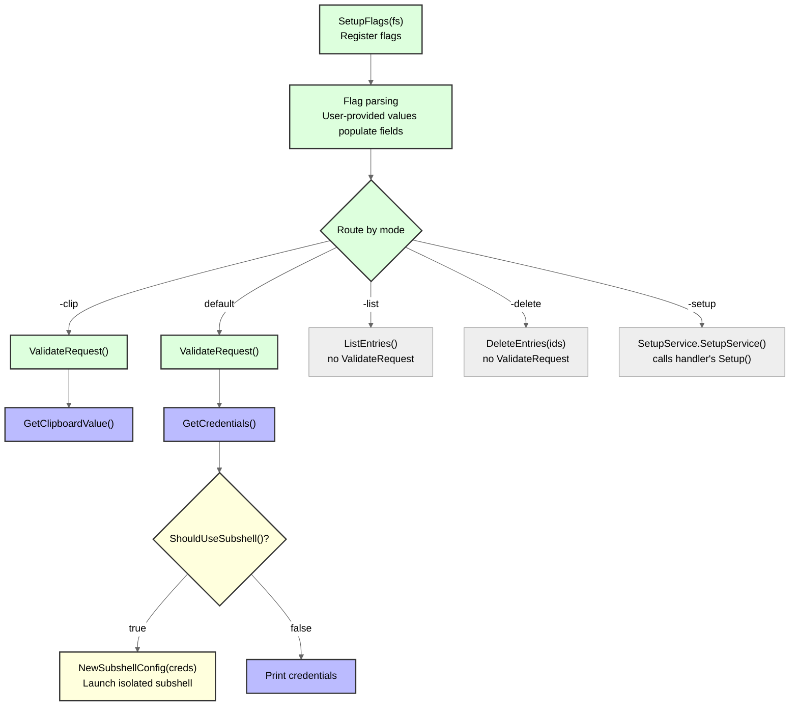

# Sesh Plugin Development Guide

This guide explains how to create new service providers for sesh. Whether you're adding support for a new cloud provider, a different authentication service, or any credential management system, this guide will walk you through the process.

## Table of Contents

1. [Architecture Overview](#architecture-overview)
2. [Creating a Basic Provider](#creating-a-basic-provider)
3. [Advanced Features](#advanced-features)
4. [Testing Your Provider](#testing-your-provider)
5. [Best Practices](#best-practices)
6. [Example: Minimal TOTP Provider](#example-minimal-totp-provider)

## Architecture Overview

Sesh uses a plugin-based architecture where each service (AWS, TOTP, etc.) is implemented as a provider. All providers must implement the `ServiceProvider` interface and register with the central Registry in `NewDefaultApp()`.

### Key Components

1. **ServiceProvider Interface**: Core contract all providers must implement
2. **Registry**: Manages provider registration and lookup
3. **Setup Handlers**: Handle initial configuration for each provider
4. **The vault (`vault.Store`)**: Where every secret lives, each one encrypted, shared by all providers
5. **Shell Customizers**: Optional subshell support

> **First time here?** Skip to [Creating a Basic Provider](#creating-a-basic-provider) and refer back to these sections when you encounter unfamiliar concepts.

### Provider Lifecycle ([SVG](assets/provider-lifecycle.svg))

When a user runs sesh, the app calls your provider methods in this order:


```mermaid
%%{init: {'theme': 'neutral'}}%%
flowchart TD
    classDef always fill:#dfd,stroke:#333,stroke-width:2px
    classDef mode fill:#bbf,stroke:#333,stroke-width:2px
    classDef optional fill:#ffd,stroke:#333,stroke-width:2px
    classDef skip fill:#eee,stroke:#999,stroke-width:1px

    SF["SetupFlags(fs)<br>Register flags"]:::always
    FP["Flag parsing<br>User-provided values populate fields"]:::always

    SF --> FP
    FP --> Route{"Route by mode"}:::always

    Route -->|"-clip"| VR1["ValidateRequest()"]:::always
    VR1 --> GCV["GetClipboardValue()"]:::mode

    Route -->|"default"| VR2["ValidateRequest()"]:::always
    VR2 --> GC["GetCredentials()"]:::mode
    GC --> Sub{"ShouldUseSubshell()?"}:::optional
    Sub -->|"true"| NSC["NewSubshellConfig(creds)<br>Launch isolated subshell"]:::optional
    Sub -->|"false"| Print["Print credentials"]:::mode

    Route -->|"-list"| LE["ListEntries()<br>no ValidateRequest"]:::skip
    Route -->|"-delete"| DE["DeleteEntries(ids)<br>no ValidateRequest"]:::skip
    Route -->|"-setup"| Setup["SetupService.SetupService()<br>calls handler's Setup()"]:::skip
```

Key points:
- `SetupFlags` runs for **all** modes — it's where you register flags
- `ValidateRequest` only runs for credential and clipboard modes — list/delete/setup skip it
- `ShouldUseSubshell` and `NewSubshellConfig` are optional interfaces — only implement them if your provider needs a subshell

### Key Types

Types you'll work with (defined in `internal/provider/interfaces.go`):

```go
// Credentials is returned by GetCredentials() and GetClipboardValue()
type Credentials struct {
    Provider             string            // Your provider name
    Expiry               time.Time         // When credentials expire (used by subshell timer)
    Variables            map[string]string // Environment variables to set in subshell
    DisplayInfo          string            // Shown to the user on stderr (use FormatRegularDisplayInfo helper)
    Value                string            // What the user asked for (e.g. a code), printed alone to stdout so it can be captured
    CopyValue            string            // Value copied to clipboard (set by GetClipboardValue)
    ClipboardDescription string            // Short label for CopyValue (e.g., "TOTP code")
    MFAAuthenticated     bool              // True if the service accepted an MFA code
}

// ProviderEntry is returned by ListEntries()
type ProviderEntry struct {
    Name   string   // Display name (e.g., "github (work)")
    Type   string   // What kind of entry it is, shown in --list's TYPE column (e.g., "totp")
    ID     string   // The entry's key in text form ("totp/github/work"); DeleteEntries() receives it
    Folder string   // The entry's folder, "" for none
    Tags   []string // The entry's tags
}

// FlagInfo is returned by GetFlagInfo() for help text generation
type FlagInfo struct {
    Name        string // Flag name (e.g., "service-name")
    Type        string // "string", "bool", or "int"
    Description string // Help text
    Required    bool
}
```

### Embedded Helpers

**`provider.Clock`** — Testable time. Provides `TimeNow()` (returns `time.Now()` by default, overridable in tests via the `Now` field) and `SecondsLeftInWindow()` (seconds remaining in the current 30-second TOTP window). Real providers embed it; it's recommended, not required.

### Where a Provider Keeps Its Secrets (`vault` package)

Every provider receives the same `vault.Store` (`internal/vault/vault.go`): one encrypted vault per user, which the password manager, `-service totp`, and `-service aws` all use. You don't create storage of your own, and the vault handles encryption, the audit log, backups (export/import), and key changes for every entry.

An entry is named by a `vault.Key`:

```go
type Key struct {
    Kind     Kind   // vault.KindPassword, KindAPIKey, KindTOTP, or KindNote
    Service  string // what the user names it by, e.g. "github"
    Username string // optional; tells several accounts for one service apart
}
```

Kind, service, and username are unique together. Choosing your provider's entries comes down to three decisions:

- **Kind.** Use the kind that matches what the secret is. Most providers store either a TOTP secret (`KindTOTP`) or a token or key (`KindAPIKey`). The kind decides how the rest of sesh treats the entry: TOTP entries show up in `-service totp`, and every entry shows up in the password manager's list, search, and exports.
- **Service and username.** Use the service the user names (as `-service totp` does with `--service-name`), or a fixed one for your service (as the AWS provider does with `"aws"`). Put the account or profile in the username. Neither may contain `/` or control characters (`Key.Validate` checks).
- **Settings.** Anything that isn't secret but belongs with the secret goes in `vault.Settings`: a TOTP entry's code settings (`Settings.TOTP`, algorithm, digits, period, issuer) or the AWS MFA device (`Settings.AWSMFADevice`). Settings travel with the entry through exports and key changes.

The store's methods:

```go
type Store interface {
    Get(k Key) ([]byte, error)            // the secret; the caller zeroes it
    Put(k Key, secret []byte) error       // create, or replace the secret (keeps settings and creation time)
    Save(e *Entry, secret []byte) error   // create or replace the whole entry: secret, settings, times
    SetSettings(k Key, s Settings) error  // replace the settings
    Lookup(k Key) (Entry, error)          // the entry without its secret
    List(f Filter) ([]Entry, error)       // entries matching Filter{Kind, Service}; empty fields match all
    Delete(k Key) error
}
```

Every method returns an error wrapping `vault.ErrNotFound` for an entry the store doesn't hold; check it with `errors.Is`.

A key's text form, `kind/service` or `kind/service/username` (`Key.String()`, read back with `vault.ParseKey`), is the entry's ID: `-list` shows it and `-delete` takes it. The audit log names entries the same way.

### Reference Files

When implementing a new provider, these are the files to study:

| File | Priority | What to learn |
|------|----------|--------------|
| `internal/provider/interfaces.go` | Essential | All interfaces and type definitions |
| `internal/vault/vault.go` | Essential | Keys, kinds, settings, and the `Store` interface |
| `internal/provider/totp/provider.go` | Essential | Clean provider example (no subshell, clipboard-focused) |
| `internal/provider/password/provider.go` | Essential | Full provider with actions, prompts, JSON output, search |
| `internal/provider/aws/provider.go` | Reference | Full provider with subshell, TOTP, retry logic, settings |
| `internal/setup/setup.go` | When writing setup | Setup handler patterns |
| `internal/vault/memstore.go` | When writing tests | `vault.NewMemStore()`, an in-memory store |

## Creating a Basic Provider

The steps below build a provider for a service that issues API tokens, one per account. Its entries are API keys under the service name `yourservice`, with the account as the username: `api_key/yourservice/work`.

### Step 1: Create Provider Structure

Create a new package under `internal/provider/yourservice/`:

```go
package yourservice

import (
    "errors"
    "fmt"

    "github.com/bashhack/sesh/internal/provider"
    "github.com/bashhack/sesh/internal/secure"
    "github.com/bashhack/sesh/internal/vault"
)

// serviceName is the service every entry of this provider is stored under.
const serviceName = "yourservice"

type Provider struct {
    store vault.Store

    provider.Clock // Embeds testable time and SecondsLeftInWindow()

    // Provider-specific fields
    account string
    force   bool // --force: delete without asking
}

func NewProvider(store vault.Store) *Provider {
    return &Provider{store: store}
}

// key is the entry the flags name.
func (p *Provider) key() vault.Key {
    return vault.Key{Kind: vault.KindAPIKey, Service: serviceName, Username: p.account}
}
```

### Step 2: Implement Required Methods

#### Basic Identification

```go
func (p *Provider) Name() string {
    return "yourservice"
}

func (p *Provider) Description() string {
    return "Your Service - Brief description of what this provider does"
}
```

#### Flag Setup

```go
func (p *Provider) SetupFlags(fs provider.FlagSet) error {
    fs.StringVar(&p.account, "account", "", "Account name (for several accounts)")
    fs.BoolVar(&p.force, "force", false, "Delete without asking")
    return nil
}

func (p *Provider) GetFlagInfo() []provider.FlagInfo {
    return []provider.FlagInfo{
        {
            Name:        "account",
            Type:        "string",
            Description: "Account name (for several accounts)",
            Required:    false,
        },
        {Name: "force", Type: "bool", Description: "Delete without asking"},
    }
}
```

#### Validation

`Lookup` checks that the entry exists without decrypting its secret:

```go
func (p *Provider) ValidateRequest() error {
    if _, err := p.store.Lookup(p.key()); err != nil {
        if !errors.Is(err, vault.ErrNotFound) {
            return fmt.Errorf("failed to look up the token: %w", err)
        }
        return fmt.Errorf("no token stored for %s. Run: sesh -service yourservice -setup", p.key())
    }
    return nil
}
```

#### Credential Generation

```go
func (p *Provider) GetCredentials() (provider.Credentials, error) {
    secret, err := p.store.Get(p.key())
    if err != nil {
        return provider.Credentials{}, fmt.Errorf("failed to retrieve the token: %w", err)
    }
    defer secure.SecureZeroBytes(secret)

    // Convert at the boundary where string is required (e.g., env vars)
    tokenStr := string(secret)
    defer secure.SecureZeroString(tokenStr)

    return provider.Credentials{
        Provider: p.Name(),
        Variables: map[string]string{
            "YOUR_SERVICE_TOKEN": tokenStr,
        },
        DisplayInfo: provider.FormatRegularDisplayInfo("credentials", serviceName),
    }, nil
}

// GetClipboardValue returns a value to copy to clipboard.
// For TOTP-based providers, use the CreateClipboardCredentials helper (see TOTP
// Integration below). For non-TOTP providers (passwords, API keys), set
// CopyValue and ClipboardDescription directly as shown here.
func (p *Provider) GetClipboardValue() (provider.Credentials, error) {
    secret, err := p.store.Get(p.key())
    if err != nil {
        return provider.Credentials{}, fmt.Errorf("failed to retrieve the token: %w", err)
    }
    defer secure.SecureZeroBytes(secret)

    return provider.Credentials{
        Provider:             p.Name(),
        CopyValue:            string(secret),
        ClipboardDescription: "token",
    }, nil
}
```

#### Entry Management

List your provider's entries with a `vault.Filter`, and use each key's text form as its ID. `DeleteEntries` receives those IDs back. Hand them to `provider.DeleteEntries` with a check that each names one of your provider's entries, so `-service yourservice -delete` can't remove another provider's secret. It checks every ID before deleting anything, asks once (`confirm`) unless your `--force` says not to, and deletes them all or none. Define `--force` (a bool flag, also listed in `GetFlagInfo`): without a terminal, as in a script, sesh deletes only when it's set, so a provider without it can't delete from a script:

```go
func (p *Provider) ListEntries() ([]provider.ProviderEntry, error) {
    entries, err := p.store.List(vault.Filter{Kind: vault.KindAPIKey, Service: serviceName})
    if err != nil {
        return nil, fmt.Errorf("failed to list entries: %w", err)
    }

    result := make([]provider.ProviderEntry, 0, len(entries))
    for i := range entries {
        e := &entries[i]
        result = append(result, provider.ProviderEntry{
            ID:     e.Key.String(), // e.g. "api_key/yourservice/work"
            Name:   fmt.Sprintf("%s (%s)", e.Service, e.Username),
            Type:   "api token",
            Folder: e.Folder,
            Tags:   e.Tags,
        })
    }
    return result, nil
}

func (p *Provider) DeleteEntries(ids []string, confirm provider.ConfirmDelete) (int, error) {
    own := func(k vault.Key) error {
        if k.Kind != vault.KindAPIKey || k.Service != serviceName {
            return fmt.Errorf("%s isn't a %s entry; delete it with --service password", k, serviceName)
        }
        return nil
    }
    return provider.DeleteEntries(p.store, ids, own, nil, p.force, confirm)
}
```

#### Setup Handler Reference

```go
func (p *Provider) GetSetupHandler() any {
    return setup.NewYourServiceSetupHandler(p.store)
}
```

This returns an object implementing `setup.SetupHandler` (see Step 3 below). The `any` return type allows the setup system to work without providers importing the setup package's concrete types.

### Step 3: Create Setup Handler

Create `internal/setup/yourservice_setup.go`. Living in `internal/setup/` gives the handler the package's helpers: `readLine` reads a line, `readPassword` reads a secret without echoing it (both are variables that tests replace), and `entryExists` checks for an entry.

Store everything about the entry in one write, so a failure can't leave half a setup behind: `Put` for a secret alone, `Save` when it has settings (the TOTP and AWS wizards store the secret and its settings together this way).

```go
package setup

import (
    "bufio"
    "fmt"
    "os"
    "syscall"

    "github.com/bashhack/sesh/internal/secure"
    "github.com/bashhack/sesh/internal/vault"
)

type YourServiceSetupHandler struct {
    store  vault.Store
    reader *bufio.Reader
}

func NewYourServiceSetupHandler(store vault.Store) *YourServiceSetupHandler {
    return &YourServiceSetupHandler{store: store, reader: bufio.NewReader(os.Stdin)}
}

func (h *YourServiceSetupHandler) ServiceName() string {
    return "yourservice"
}

// filing is where --folder and --tag say to file the entry; the built-in
// wizards ask when it's zero.
func (h *YourServiceSetupHandler) Setup(filing vault.Filing) error {
    fmt.Println("🔧 Setting up Your Service")

    fmt.Print("Account name (leave empty for none): ")
    account, err := readLine(h.reader)
    if err != nil {
        return err
    }
    k := vault.Key{Kind: vault.KindAPIKey, Service: "yourservice", Username: account}
    if err := k.Validate(); err != nil {
        return err
    }
    exists, err := entryExists(h.store, k)
    if err != nil {
        return err
    }
    if exists {
        fmt.Println("⚠️  A token is already stored for this account; it will be replaced.")
    }

    fmt.Print("Token: ")
    secret, err := readPassword(syscall.Stdin)
    fmt.Println()
    if err != nil {
        return fmt.Errorf("failed to read the token: %w", err)
    }
    defer secure.SecureZeroBytes(secret)

    e := vault.Entry{Key: k}
    filing.Apply(&e)
    if err := h.store.Save(&e, secret); err != nil {
        return fmt.Errorf("failed to store the token: %w", err)
    }
    fmt.Printf("✅ Token stored as %s\n", k)
    return nil
}
```

### Step 4: Register Provider

In `sesh/cmd/sesh/app.go`, add registration in `NewDefaultApp()`, which `main.go` calls with the opened vault:

```go
func NewDefaultApp(versionInfo VersionInfo, store vault.Store, clipboardTimeout time.Duration) *App {
    // ... existing setup ...

    registry := provider.NewRegistry()
    // ... existing providers ...
    registry.RegisterProvider(yourservice.NewProvider(store)) // Add totpSvc if using TOTP integration

    setupSvc := setup.NewSetupService()
    // ... existing handlers ...
    setupSvc.RegisterHandler(setup.NewYourServiceSetupHandler(store))

    return &App{
        Registry:     registry,
        SetupService: setupSvc,
        // ...
    }
}
```

## Advanced Features

### Additional Capabilities

Providers can declare subshell preference by implementing the optional `SubshellDecider` interface:

```go
// SubshellDecider indicates whether this provider prefers subshell mode
// over printing credentials. Implement this to opt into subshell behavior.
func (p *Provider) ShouldUseSubshell() bool {
    return true // or false to default to print/clipboard mode
}
```

> **Important:** If `ShouldUseSubshell()` returns true, your provider **must** also implement `SubshellProvider` (below). If it doesn't, users will get a runtime error: "provider X does not support subshell customization."

### Subshell Support

To add subshell support, implement the `SubshellProvider` interface. The real AWS customizer (`internal/aws/subshell.go`) adds an expiry countdown and helper commands; the example below is simplified to show the required structure:

```go
func (p *Provider) NewSubshellConfig(creds *provider.Credentials) any {
    return subshell.Config{
        ServiceName:     p.Name(),
        Variables:       creds.Variables,
        Expiry:          creds.Expiry,
        ShellCustomizer: &YourServiceShellCustomizer{},
    }
}

type YourServiceShellCustomizer struct{}

func (c *YourServiceShellCustomizer) GetZshInitScript() string {
    return `
        # Your service specific zsh initialization
        your_service_status() {
            echo "Your service is active"
        }
    `
}

func (c *YourServiceShellCustomizer) GetBashInitScript() string {
    return `
        # Your service specific bash initialization
        your_service_status() {
            echo "Your service is active"
        }
    `
}

func (c *YourServiceShellCustomizer) GetFallbackInitScript() string {
    return `
        # Fallback for shells other than bash/zsh
        your_service_status() {
            echo "Your service is active"
        }
    `
}

func (c *YourServiceShellCustomizer) GetPromptPrefix() string {
    return "yourservice"
}
```

### TOTP Integration

A provider that generates codes stores its secret as a `KindTOTP` entry and takes a `totp.Provider` (`internal/totp`). Its code settings (algorithm, digits, period) are in the entry's `Settings.TOTP`; zero means the usual ones (SHA1, 6 digits, 30 seconds). Read them with `Lookup` and generate with `GenerateConsecutiveCodesBytesWithParams`:

```go
func (p *Provider) GetClipboardValue() (provider.Credentials, error) {
    k := vault.Key{Kind: vault.KindTOTP, Service: p.serviceName, Username: p.profile}
    secret, err := p.store.Get(k)
    if err != nil {
        return provider.Credentials{}, err
    }
    defer secure.SecureZeroBytes(secret)

    // The settings decide which codes are right, so failing to read them
    // is an error, not a reason to fall back to the defaults.
    e, err := p.store.Lookup(k)
    if err != nil {
        return provider.Credentials{}, fmt.Errorf("failed to read the code settings: %w", err)
    }

    currentCode, nextCode, err := p.totp.GenerateConsecutiveCodesBytesWithParams(secret, e.Settings.TOTP)
    if err != nil {
        return provider.Credentials{}, err
    }

    return provider.CreateClipboardCredentials(
        p.Name(), currentCode, nextCode, p.SecondsLeftInWindow(),
        "TOTP code", p.serviceName,
    ), nil
}
```

**Code settings**: When a QR code is scanned during setup, `totp.Params` (algorithm, digits, period, issuer) are taken from the `otpauth://` URI and saved with the secret in `Settings.TOTP`. Most services use the usual settings, but some use others; reading `Settings.TOTP` gives the right codes either way.

Because TOTP entries are shared, a secret stored under `KindTOTP` is also visible to `-service totp` and the password manager's `totp-generate`. Store under your own service name, or the user's, as fits your provider.

## Testing Your Provider

### Unit Tests

Use `vault.NewMemStore()`, an in-memory `vault.Store`, seeded with `Put` or `Save`, and assert against what it holds. There's no mocks package to set up:

```go
import (
    "errors"
    "testing"

    "github.com/bashhack/sesh/internal/vault"
)

func TestProvider_GetCredentials(t *testing.T) {
    store := vault.NewMemStore()
    k := vault.Key{Kind: vault.KindAPIKey, Service: "yourservice", Username: "work"}
    if err := store.Put(k, []byte("secret123")); err != nil {
        t.Fatal(err)
    }

    tests := map[string]struct {
        account     string
        wantNoEntry bool
    }{
        "stored token": {account: "work"},
        "no token":     {account: "home", wantNoEntry: true},
    }
    for name, tc := range tests {
        t.Run(name, func(t *testing.T) {
            p := NewProvider(store)
            p.account = tc.account

            creds, err := p.GetCredentials()
            if tc.wantNoEntry {
                if !errors.Is(err, vault.ErrNotFound) {
                    t.Errorf("err = %v, want ErrNotFound", err)
                }
                return
            }
            if err != nil {
                t.Fatal(err)
            }
            if creds.Variables["YOUR_SERVICE_TOKEN"] != "secret123" {
                t.Errorf("YOUR_SERVICE_TOKEN = %q, want the stored token", creds.Variables["YOUR_SERVICE_TOKEN"])
            }
        })
    }
}
```

For error paths, wrap the in-memory store and override the method that should fail:

```go
// failingStore is an in-memory store whose Get fails.
type failingStore struct{ *vault.MemStore }

func (failingStore) Get(vault.Key) ([]byte, error) {
    return nil, errors.New("vault locked")
}
```

If you write a new `vault.Store` implementation rather than a provider, run the shared behaviour suite against it, as the vault and the in-memory store do:

```go
func TestMyStore(t *testing.T) {
    vaulttest.Run(t, func(t *testing.T) vault.Store { return newMyStore(t) })
}
```

### Building and Running Tests

```bash
# Run all tests
make test

# Run tests for your provider only
go test ./internal/provider/yourservice/...

# Run fast tests (skip integration tests)
make test/short

# Full audit: test + lint + vet
make audit

# Build and run locally
make build && ./build/sesh -help
```

## Best Practices

### Security

1. **Always zero sensitive data**: Use `secure.SecureZeroBytes()` on secrets from `Get`
2. **Work with byte slices**: `Get` returns `[]byte`; convert to a string only where one is required (an environment variable, the clipboard)
3. **Validate early**: Check the entry exists (`Lookup`, which doesn't decrypt) before expensive operations
4. **Clipboard awareness**: sesh clears the clipboard 30 seconds after a copy (`clipboard_timeout`), if it still holds the copied value, on macOS and Linux. Until then, clipboard managers can see it.

### User Experience

1. **Clear error messages**: Include setup instructions in errors
2. **Interactive setup**: Guide users through configuration
3. **Account support**: Use the username for several accounts of one service
4. **Consistent naming**: Follow existing patterns for flags and commands

### Code Organization

1. **Single responsibility**: Keep provider focused on one service
2. **Dependency injection**: Accept interfaces (`vault.Store`, `totp.Provider`), not concrete types
3. **Error wrapping**: Use `fmt.Errorf` with `%w` for error context
4. **One key helper**: Build your entries' keys in one place (a `key()` method), so every method names the same entry

## Example: Minimal TOTP Provider

Here's a complete minimal example for a TOTP service, storing its secrets as TOTP entries under the service name the user gives:

```go
package simple

import (
    "fmt"

    "github.com/bashhack/sesh/internal/provider"
    "github.com/bashhack/sesh/internal/secure"
    "github.com/bashhack/sesh/internal/totp"
    "github.com/bashhack/sesh/internal/vault"
)

type Provider struct {
    store vault.Store
    totp  totp.Provider
    provider.Clock
    serviceName string
    force       bool // --force: delete without asking
}

func NewProvider(store vault.Store, totp totp.Provider) *Provider {
    return &Provider{store: store, totp: totp}
}

func (p *Provider) key() vault.Key {
    return vault.Key{Kind: vault.KindTOTP, Service: p.serviceName}
}

func (p *Provider) Name() string        { return "simple" }
func (p *Provider) Description() string { return "Simple TOTP provider" }

func (p *Provider) SetupFlags(fs provider.FlagSet) error {
    fs.StringVar(&p.serviceName, "service-name", "", "Service name")
    fs.BoolVar(&p.force, "force", false, "Delete without asking")
    return nil
}

func (p *Provider) GetFlagInfo() []provider.FlagInfo {
    return []provider.FlagInfo{
        {Name: "service-name", Type: "string", Description: "Service name", Required: true},
        {Name: "force", Type: "bool", Description: "Delete without asking"},
    }
}

func (p *Provider) ValidateRequest() error {
    if p.serviceName == "" {
        return fmt.Errorf("--service-name is required")
    }
    return nil
}

func (p *Provider) GetCredentials() (provider.Credentials, error) {
    return provider.Credentials{}, fmt.Errorf("TOTP provider only supports clipboard mode: use -clip")
}

func (p *Provider) GetClipboardValue() (provider.Credentials, error) {
    secret, err := p.store.Get(p.key())
    if err != nil {
        return provider.Credentials{}, err
    }
    defer secure.SecureZeroBytes(secret)

    // The entry's code settings (algorithm, digits, period); services using
    // SHA-256/SHA-512, 8-digit codes, or another period need them.
    e, err := p.store.Lookup(p.key())
    if err != nil {
        return provider.Credentials{}, fmt.Errorf("failed to read the code settings: %w", err)
    }
    currentCode, nextCode, err := p.totp.GenerateConsecutiveCodesBytesWithParams(secret, e.Settings.TOTP)
    if err != nil {
        return provider.Credentials{}, err
    }

    return provider.CreateClipboardCredentials(
        p.Name(), currentCode, nextCode, p.SecondsLeftInWindow(),
        "TOTP code", p.serviceName,
    ), nil
}

func (p *Provider) ListEntries() ([]provider.ProviderEntry, error) {
    entries, err := p.store.List(vault.Filter{Kind: vault.KindTOTP})
    if err != nil {
        return nil, err
    }
    result := make([]provider.ProviderEntry, 0, len(entries))
    for i := range entries {
        result = append(result, provider.ProviderEntry{
            ID:     entries[i].Key.String(),
            Name:   entries[i].Service,
            Type:   "totp",
            Folder: entries[i].Folder,
            Tags:   entries[i].Tags,
        })
    }
    return result, nil
}

func (p *Provider) DeleteEntries(ids []string, confirm provider.ConfirmDelete) (int, error) {
    own := func(k vault.Key) error {
        if k.Kind != vault.KindTOTP {
            return fmt.Errorf("%s isn't a TOTP entry", k)
        }
        return nil
    }
    return provider.DeleteEntries(p.store, ids, own, nil, p.force, confirm)
}

// ShouldUseSubshell implements the optional SubshellDecider interface.
// Return false for TOTP-only providers that don't need a subshell.
func (p *Provider) ShouldUseSubshell() bool {
    return false
}

func (p *Provider) GetSetupHandler() any {
    // Return a setup.SetupHandler implementation (see Step 3 above)
    return nil // Replace with your setup handler
}
```

## Next Steps

1. Review existing providers for patterns and conventions
2. Start with a minimal implementation
3. Add tests as you go
4. Submit a PR with your new provider

For questions or help, please open an issue on GitHub.
