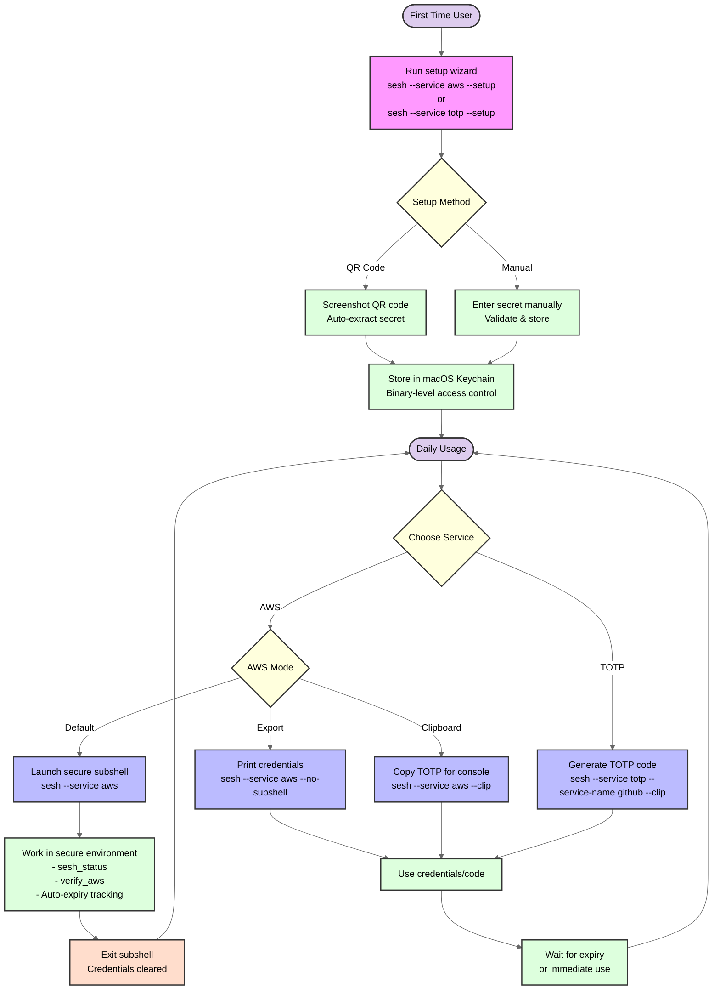
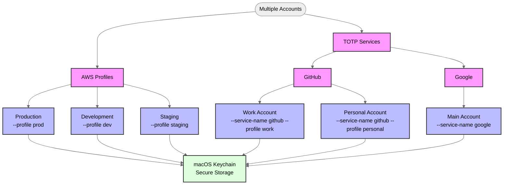

# sesh Usage and Configuration Guide

This document provides detailed instructions for using and configuring sesh for secure authentication workflows across multiple providers.

## Workflow Overview

The diagram below shows the complete workflow for using sesh, from initial setup through daily usage:



## Basic Usage

The simplest way to use sesh is to set up a provider and start authenticating:

```bash
# First time setup for AWS
sesh --service aws --setup

# ... or for general TOTP provider usage (e.g., any TOTP)
sesh --service totp --setup

# Daily usage - launch secure AWS subshell
sesh --service aws

# Generate and copy TOTP code for any service provider
sesh --service totp --service-name github --clip
```

This will:

1. **For AWS**: Launch a secure subshell with temporary credentials activated and MFA authenticated
2. **For TOTP**: Generate, display and copy a 6-digit code with time remaining - can be pasted into web forms, etc. immediately

## Configuration Methods

sesh uses a provider-based configuration system:

1. **Global flags** - Apply to all providers (e.g., `--service`, `--help`)
2. **Provider-specific flags** - Apply only to the selected provider (e.g., `--profile` for AWS)
3. **Environment variables** - For default AWS profile selection
4. **Keychain storage** - Secure storage for all secrets and metadata

## Configuration Options

### Global Options

| Command Flag       | Description                                        | Available For    |
|--------------------|----------------------------------------------------|------------------|
| `--service`        | Service provider to use (aws, totp) [REQUIRED]    | All commands     |
| `--list-services`  | List all available service providers               | Global           |
| `--list`           | List entries for selected service                  | All providers    |
| `--delete <id>`    | Delete entry for selected service                  | All providers    |
| `--setup`          | Run interactive setup wizard                       | All providers    |
| `--clip`           | Copy generated code to clipboard                   | All providers    |
| `--version`        | Display version information                        | Global           |
| `--help`           | Show help (use with --service for provider help)  | Global           |

### AWS Provider Options

| Command Flag       | Environment Variable | Description                             | Default Value    |
|--------------------|----------------------|-----------------------------------------|------------------|
| `--profile`        | `AWS_PROFILE`        | AWS profile to use                      | default profile  |
| `--no-subshell`    | n/a                  | Print credentials instead of subshell   | false (subshell) |

### TOTP Provider Options

| Command Flag       | Description                                        | Required         |
|--------------------|----------------------------------------------------|------------------|
| `--service-name`   | Name of service (github, google, slack, etc.)      | Yes              |
| `--profile`        | Profile name for multiple accounts (work, personal)| No               |

## Usage Patterns

### Basic Examples

```bash
# View all available options
sesh --help

# View provider-specific help
sesh --service aws --help
sesh --service totp --help

# List available providers
sesh --list-services

# Setup wizards
sesh --service aws --setup
sesh --service totp --setup
```

### 💡 Best Practice: AWS Development Workflow

The most efficient AWS development workflow uses sesh's subshell mode, which provides an isolated environment with automatic credential management:

```bash
# Launch secure subshell for development
sesh --service aws

# Inside the subshell:
# 1. Your prompt shows you're in a sesh environment
# 2. AWS credentials are automatically configured
# 3. Use built-in commands:
sesh_status    # Check session status and expiry
verify_aws     # Test AWS connectivity
sesh_help      # Show available commands

# Work normally with AWS CLI
aws s3 ls
aws ec2 describe-instances

# Exit when done - credentials are automatically cleared
exit
```

### AWS Console Access Workflow

For AWS Console (web) access, use the clipboard mode to avoid the "code already used" error:

```bash
# Copy TOTP code for AWS Console login
sesh --service aws --clip

# This generates TWO consecutive codes:
# - Current time window code
# - Next time window code
# Paste whichever one works in the AWS Console
```

### TOTP Service Workflow

For general TOTP services, sesh provides a simple, secure workflow:

```bash
# Generate TOTP code for any service
sesh --service totp --service-name github

# Copy to clipboard for easy pasting
sesh --service totp --service-name github --clip

# Use profiles for multiple accounts
sesh --service totp --service-name github --profile work
sesh --service totp --service-name github --profile personal

# List all TOTP entries
sesh --service totp --list
```

### Multi-Profile Management



#### Benefits of sesh's Multi-Profile Approach:

- **Unified Interface**: One tool for all your MFA needs (AWS, GitHub, Google, etc.)
- **Secure Storage**: All secrets in macOS Keychain with binary-level access control
- **Profile Isolation**: Keep work and personal accounts completely separate
- **No Mobile Dependency**: Generate codes directly in your terminal
- **Scriptable**: Integrate into your automation workflows
- **Privacy-First**: No cloud sync, no tracking, no corporate oversight

### Why sesh Over Mobile Authenticators:

- **Terminal-Native**: No context switching to your phone
- **Faster**: Type a command vs. unlock phone → find app → find code
- **Scriptable**: Can be integrated into automated workflows
- **Secure**: Keychain storage is more secure than many mobile apps
- **Private**: Your auth codes stay on your machine

### Entry Management

Sesh provides comprehensive entry management capabilities:

```bash
# List all entries for a service
sesh --service aws --list
sesh --service totp --list

# Delete entries by ID
sesh --service aws --delete aws-123
sesh --service totp --delete totp-github-work

# Entries are named systematically:
# AWS: sesh-aws-{profile}
# TOTP: sesh-totp-{service}-{profile}
```

### Setup Wizard Features

The interactive setup wizard guides you through configuration:

```bash
# AWS Setup
sesh --service aws --setup
# - Prompts for MFA device setup in AWS Console
# - Handles QR code scanning or manual entry
# - Validates and stores secret securely
# - Provides test codes for AWS activation

# TOTP Setup
sesh --service totp --setup
# - Prompts for service name
# - Optional profile name for multiple accounts
# - QR code scanning via screenshot
# - Manual secret entry fallback
```

### Troubleshooting Mode

When encountering issues, use verbose output:

```bash
# Get detailed help for a provider
sesh --service aws --help
sesh --service totp --help

# Common issues:
# 1. "No MFA device found" - Check AWS profile or specify --profile
# 2. "Code already used" - Use --clip mode for AWS Console
# 3. "Invalid secret" - Ensure base32 encoding during setup
```

## Environment Variables

```bash
# Set default AWS profile
export AWS_PROFILE=production
sesh --service aws  # Uses production profile

# AWS credential environment (set by subshell)
# AWS_ACCESS_KEY_ID
# AWS_SECRET_ACCESS_KEY
# AWS_SESSION_TOKEN
# SESH_ACTIVE=1
# SESH_SERVICE=aws
# SESH_EXPIRY=<unix-timestamp>
```

## Default Behavior

When run without additional flags, sesh will:

1. **For AWS (`--service aws`)**: Launch a secure subshell with 12-hour session credentials
2. **For TOTP (`--service totp`)**: Display the current code with time remaining
3. **Setup Required**: First-time users must run `--setup` for each service
4. **Profile Selection**: Uses default AWS profile or requires `--service-name` for TOTP
5. **Security**: All secrets stored in macOS Keychain with binary-level access control

## Subshell Behavior

The AWS subshell provides:

- **Visual Indicators**: Custom prompt showing active sesh session
- **Auto-cleanup**: Credentials cleared on exit
- **Built-in Commands**: `sesh_status`, `verify_aws`, `sesh_help`
- **Expiry Tracking**: Automatic notification when credentials near expiration
- **Shell Support**: Full support for bash/zsh, basic support for other shells

## Related Documentation

- [Advanced Usage](ADVANCED_USAGE.md) - Deep dive into sesh features
- [Security Model](SECURITY_MODEL.md) - Understanding sesh's security architecture
- [Plugin Development](PLUGIN_DEVELOPMENT.md) - Adding new authentication providers
- [Troubleshooting](TROUBLESHOOTING.md) - Common issues and solutions
