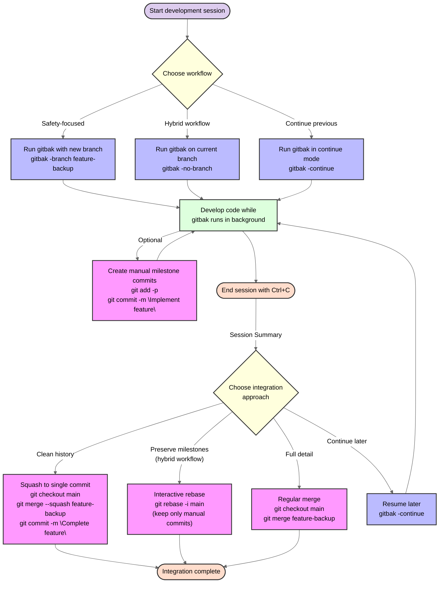

# sesh Usage and Configuration Guide

This document provides detailed instructions for using and configuring sesh for secure authentication workflows across multiple providers.

## Workflow Overview

The diagram below shows the complete workflow for using gitbak, from starting the tool through to integrating your changes after a session:



## Basic Usage

The simplest way to use gitbak is to navigate to your Git repository and run:

```bash
gitbak
```

This will:

1. Create a new branch named `gitbak-<timestamp>`
2. Start committing changes automatically every 5 minutes
3. Display a summary when you terminate the process (Ctrl+C)

## Configuration Methods

gitbak can be configured using:

1. Command-line flags (highest priority)
2. Environment variables
3. Default values (lowest priority)

## Configuration Options

| Command Flag       | Environment Variable | Description                                 | Default Value          |
|--------------------|----------------------|---------------------------------------------|------------------------|
| `-interval`        | `INTERVAL_MINUTES`   | Minutes between commit checks (decimal OK)  | 5.0                    |
| `-branch`          | `BRANCH_NAME`        | Branch name to use                          | gitbak-<timestamp>     |
| `-prefix`          | `COMMIT_PREFIX`      | Commit message prefix                       | [gitbak]               |
| `-no-branch`       | `CREATE_BRANCH=false`| Stay on current branch                      | false (creates branch) |
| `-continue`        | `CONTINUE_SESSION`   | Continue existing session                   | false                  |
| `-show-no-changes` | `SHOW_NO_CHANGES`    | Show messages when no changes detected      | false                  |
| `-quiet`           | `VERBOSE=false`      | Hide informational messages                 | false (verbose)        |
| `-repo`            | `REPO_PATH`          | Path to repository                          | current directory      |
| `-max-retries`     | `MAX_RETRIES`        | Max consecutive identical errors before exit| 3                      |
| `-debug`           | `DEBUG`              | Enable debug logging                        | false                  |
| `-log-file`        | `LOG_FILE`           | Path to log file                            | ~/.local/share/gitbak/logs/gitbak-<hash>.log |
| `-version`         | n/a                  | Print version information and exit          | n/a                    |
| `-logo`            | n/a                  | Display ASCII logo and exit                 | n/a                    |
| `-help`/`-h`       | n/a                  | Display help message and exit               | n/a                    |

## Usage Patterns

### Basic Examples

```bash
# View all available options
gitbak -help

# Custom interval (2 minutes)
gitbak -interval 2

# 30-second intervals (using decimal)
gitbak -interval 0.5

# Custom branch name
gitbak -branch "feature-work-backup"

# Custom commit prefix
gitbak -prefix "[auto-save]"
```

### 💡 Best Practice: Mixing Manual Commits with Automatic Checkpoints

One of gitbak's most powerful workflows is combining automatic safety checkpoints with manual milestone commits. This hybrid approach gives you both safety and meaningful history - something no IDE auto-save feature can match.

```bash
# Start gitbak on the current branch
gitbak -no-branch

# While gitbak runs in the background:
# 1. Make changes to your code
# 2. When you reach a meaningful milestone, make a manual commit:
git add <specific-files>
git commit -m "Implement login feature"

# 3. Continue working - gitbak will keep making checkpoints between your manual commits
```

### Hybrid Workflow Visualization

The diagram below illustrates how gitbak's automatic checkpoint commits work alongside your manual milestone commits:

```mermaid
%%{init: {'theme': 'neutral', 'flowchart': {'curve': 'basis'}}}%%
flowchart LR
    classDef autoCommit fill:#bbf,stroke:#333,stroke-width:2px
    classDef manualCommit fill:#f9f,stroke:#333,stroke-width:2px
    classDef process fill:#dfd,stroke:#333,stroke-width:2px
    classDef decision fill:#ffd,stroke:#333,stroke-width:2px
    classDef start fill:#dce,stroke:#333,stroke-width:2px
    classDef endNode fill:#fdc,stroke:#333,stroke-width:2px

    Start([Start gitbak -no-branch]):::start --> Monitor[Monitor Repository]:::process

    subgraph "Hybrid Workflow"
        %% Left side: Automatic flow
        Monitor --> Auto[Automatic Safety Commits]:::process
        Auto --> Changes{Changes<br>Detected?}:::decision
        Changes -->|Yes| AutoCommit1["[gitbak] #1"]:::autoCommit
        Changes -->|No| Wait[Wait for interval]:::process
        Wait --> Changes

        AutoCommit1 --> Wait

        %% Development continues
        Work1["Work in progress"]:::process --> Work2["More work"]:::process --> Work3["Even more work"]:::process

        %% A milestone is reached
        Work3 --> ManualCommit1["Manual commit:<br>Feature A implemented"]:::manualCommit

        %% Automatic commit continues
        Wait --> Changes2{Changes<br>Detected?}:::decision
        Changes2 -->|Yes| AutoCommit2["[gitbak] #2"]:::autoCommit
        Changes2 -->|No| Wait2[Wait for interval]:::process
        Wait2 --> Changes2

        AutoCommit2 --> Wait2

        %% More development
        ManualCommit1 --> Work4["More work"]:::process --> Work5["Further development"]:::process

        %% Another milestone
        Work5 --> ManualCommit2["Manual commit:<br>Feature B implemented"]:::manualCommit

        %% Last automatic commit
        Wait2 --> Changes3{Changes<br>Detected?}:::decision
        Changes3 -->|Yes| AutoCommit3["[gitbak] #3"]:::autoCommit

        ManualCommit2 --> End([Session end<br>Ctrl+C]):::endNode
        AutoCommit3 --> End
    end

    End --> Results["Resulting history:<br>#3 - auto<br>B - manual<br>#2 - auto<br>A - manual<br>#1 - auto"]:::endNode

    Note["gitbak intelligently maintains<br>sequential numbering<br>despite manual commits"]:::process
```



#### Benefits of this workflow:

- **Safety Net**: Automatic checkpoints happen even when you forget to commit
- **Clear History**: Important milestones are clearly marked with meaningful commit messages
- **Intelligent Numbering**: gitbak's commit counter ignores your manual commits and maintains sequential numbering
- **Clean Identification**: Easy to distinguish between automatic checkpoints and manual milestones
- **Flexible History Management**: After your session, you can:
  - Keep both automatic and manual commits
  - Use `git rebase -i` to keep only your manual milestone commits
  - Squash everything into a single commit

#### Example Commit History:

```
- [gitbak] Automatic checkpoint #3
- Manual: Feature B implemented
- [gitbak] Automatic checkpoint #2
- Manual: Feature A implemented
- [gitbak] Automatic checkpoint #1
- Initial commit
```

Note that gitbak's commit numbering system is intelligent enough to ignore manual commits and maintain sequential numbering for its automatic commits (#1, #2, #3).

#### Why This Is Superior to IDE Auto-Save:

Unlike IDE auto-save features, this workflow:
- Creates proper Git commits with timestamps and messages
- Allows you to push your history to remote repositories
- Provides permanent, navigable history that persists beyond IDE sessions
- Gives you fine-grained control over which changes become part of your commit history

### Continuation Mode

Continuation mode allows you to resume a previous gitbak session:

```bash
# Start a session
gitbak -branch feature-development

# Later, continue the same session
gitbak -continue
```

When using `-continue`:

- gitbak will not create a new branch
- It will find the highest commit number used in previous commits
- Numbering will continue from the last commit number
- This maintains a clean, sequential history

### Using the Current Branch

If you prefer not to create a separate branch:

```bash
gitbak -no-branch
```

This is useful when you're already on a development branch and want to keep all commits there.

### Debug Mode

For troubleshooting, enable debug mode:

```bash
gitbak -debug
```

This will:

1. Create a detailed log file
2. Show additional information during operation
3. Provide more context when errors occur

The log file location is displayed when starting in debug mode.

## Environment Variable Examples

```bash
# Run with 2-minute interval and custom branch name
INTERVAL_MINUTES=2 BRANCH_NAME="my-feature-backup" gitbak

# Run with debug logging enabled
DEBUG=true gitbak

# Use current branch instead of creating a new one
CREATE_BRANCH=false gitbak
```

## Default Behavior

When run without any configuration, gitbak will:

1. Create a new branch named `gitbak-<timestamp>`
2. Commit changes every 5 minutes if changes are detected
3. Prefix commit messages with `[gitbak]`
4. Only show essential messages (not showing "no changes" messages)
5. Automatically retry on errors up to 3 times before exiting

## Signal Handling

gitbak handles the following signals gracefully:

- `SIGINT` (Ctrl+C) - Stops the process and displays a summary
- `SIGTERM` - Stops the process and displays a summary
- `SIGHUP` - Handles terminal disconnection properly

This ensures that even if your terminal session is closed unexpectedly, gitbak will clean up properly.

## Related Documentation

- [After Session Guide](AFTER_SESSION.md) - What to do with your gitbak commits
- [IDE Integration](IDE_INTEGRATION.md) - How to integrate gitbak with various IDEs
