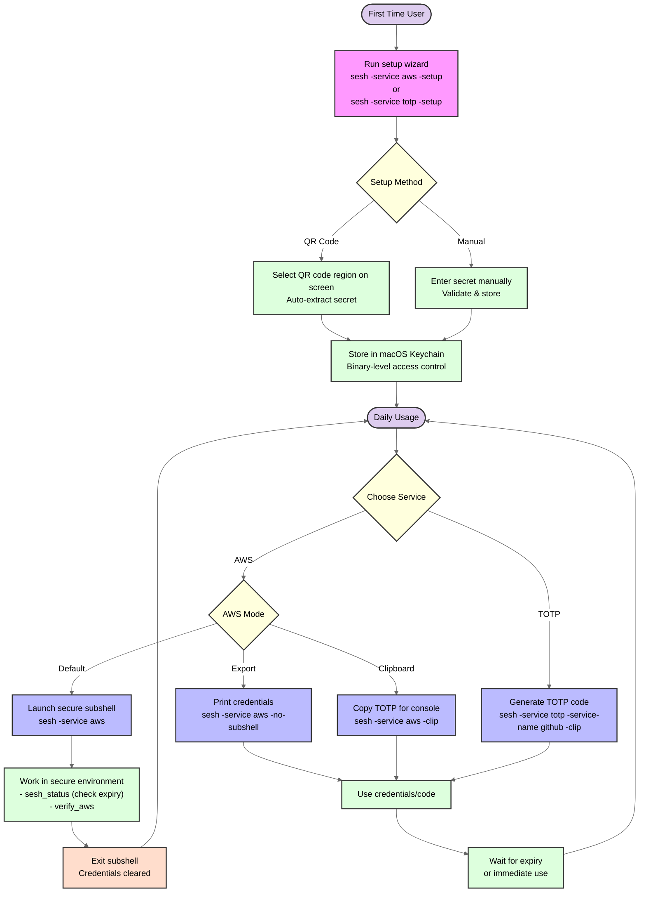
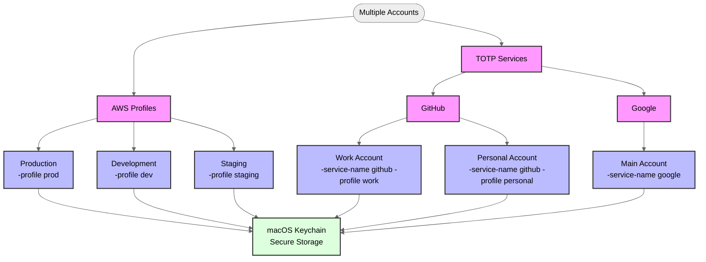

# sesh Usage and Configuration Guide

This document provides detailed instructions for using and configuring sesh for secure authentication workflows across multiple providers.

> **Requirements:** macOS (uses Keychain for secret storage). For the AWS provider, the [AWS CLI](https://docs.aws.amazon.com/cli/latest/userguide/getting-started-install.html) must be installed and configured.

## Workflow Overview

The diagram below shows the complete workflow for using sesh, from initial setup through daily usage:


```mermaid
%%{init: {'theme': 'neutral'}}%%
flowchart TD
    classDef start fill:#dce,stroke:#333,stroke-width:2px
    classDef process fill:#dfd,stroke:#333,stroke-width:2px
    classDef decision fill:#ffd,stroke:#333,stroke-width:2px
    classDef endNode fill:#fdc,stroke:#333,stroke-width:2px
    classDef sesh fill:#bbf,stroke:#333,stroke-width:2px
    classDef setup fill:#f9f,stroke:#333,stroke-width:2px

    Start([First Time User]):::start --> Setup["Run setup wizard<br>sesh -service aws -setup<br>or<br>sesh -service totp -setup"]:::setup
    
    Setup --> SetupChoice{"Setup Method"}:::decision
    SetupChoice -->|"QR Code"| QR["Select QR code region on screen<br>Auto-extract secret"]:::process
    SetupChoice -->|"Manual"| Manual["Enter secret manually<br>Validate & store"]:::process
    
    QR --> Keychain["Store in macOS Keychain<br>Binary-level access control"]:::process
    Manual --> Keychain
    
    Keychain --> Daily([Daily Usage]):::start
    
    Daily --> Service{"Choose Service"}:::decision
    
    Service -->|"AWS"| AWSChoice{"AWS Mode"}:::decision
    AWSChoice -->|"Default"| Subshell["Launch secure subshell<br>sesh -service aws"]:::sesh
    AWSChoice -->|"Export"| Export["Print credentials<br>sesh -service aws -no-subshell"]:::sesh
    AWSChoice -->|"Clipboard"| AWSClip["Copy TOTP for console<br>sesh -service aws -clip"]:::sesh
    
    Service -->|"TOTP"| TOTP["Generate TOTP code<br>sesh -service totp -service-name github -clip"]:::sesh
    
    Subshell --> Work["Work in secure environment<br>- sesh_status (check expiry)<br>- verify_aws"]:::process
    Work --> Exit["Exit subshell<br>Credentials cleared"]:::endNode
    
    Export --> Use["Use credentials/code"]:::process
    AWSClip --> Use
    TOTP --> Use
    
    Use --> Expire["Wait for expiry<br>or immediate use"]:::process
    Expire --> Daily
    
    Exit --> Daily
```

## Before You Start

Have the QR code or TOTP secret ready **before** running setup:

- **For AWS MFA:** Open AWS Console → IAM → Your User → Security Credentials → MFA devices → Assign MFA device → Select "Authenticator app." AWS will display a QR code.
- **For GitHub 2FA:** Go to GitHub Settings → Password and Authentication → Enable Two-Factor Authentication → Choose "Set up using an app." GitHub will display a QR code.
- **For any TOTP service:** Navigate to the service's security/2FA settings and start the authenticator app setup flow. Look for a QR code or a base32 secret key.

Once you can see the QR code on screen, run the setup wizard.

## Basic Usage

The simplest way to use sesh is to set up a provider and start authenticating:

```bash
# First time setup for AWS (have the AWS Console QR code visible on screen)
sesh -service aws -setup

# ... or for general TOTP provider usage (have the service's QR code visible)
sesh -service totp -setup

# Daily usage - launch secure AWS subshell
sesh -service aws

# Generate and copy TOTP code for any service provider
sesh -service totp -service-name github -clip
```

This will:

1. **For AWS**: Launch a secure subshell with temporary credentials activated and MFA authenticated
2. **For TOTP**: Generate a 6-digit code with time remaining and copy it to clipboard (with `-clip`) for immediate pasting into web forms

sesh replaces mobile and desktop authenticator apps like Authy and Google Authenticator. It works with any service that supports the standard TOTP protocol (RFC 6238).

When assessing what will work with sesh, look for these signs:
- "Works with Google Authenticator" ✅
- Shows a QR code during setup ✅
- Offers "manual entry" option ✅
- Mentions "TOTP" or "RFC 6238" ✅
- Says "enter 6-digit code" ✅

Potential red flags for compatibility are the same one would face with Authy or Google Authenticator:
- "SMS only" ❌
- "Use our app only" ❌
- "Push notification required" ❌

## Configuration Methods

sesh uses a provider-based configuration system:

1. **Global flags** - Apply to all providers (e.g., `-service`, `-help`)
2. **Provider-specific flags** - Apply only to the selected provider (e.g., `-profile` for AWS)
3. **Environment variables** - For default AWS profile selection
4. **Keychain storage** - Secure storage for all secrets and metadata

## Configuration Options

### Global Options

| Command Flag       | Description                                        | Available For    |
|--------------------|----------------------------------------------------|------------------|
| `-list-services`  | List all available service providers               | Global           |
| `-version`         | Display version information                        | Global           |
| `-help`           | Show help (use with -service for provider help)  | Global           |
| `-service`        | Service provider to use (aws, totp) [REQUIRED]    | All commands     |
| `-list`           | List entries for selected service                  | All providers    |
| `-delete <id>`    | Delete entry for selected service                  | All providers    |
| `-setup`          | Run interactive setup wizard                       | All providers    |
| `-clip`           | Copy generated code to clipboard                   | All providers    |


### AWS Provider Options

| Command Flag       | Environment Variable | Description                             | Default Value    |
|--------------------|----------------------|-----------------------------------------|------------------|
| `-profile`        | `AWS_PROFILE`        | AWS profile to use                      | default profile  |
| `-no-subshell`    | n/a                  | Print credentials instead of subshell   | false (subshell) |

**Profile precedence:** `-profile` flag > `$AWS_PROFILE` environment variable > `"default"`. If neither flag nor env var is set, sesh uses the profile named `"default"`.

### TOTP Provider Options

| Command Flag       | Description                                        | Required         |
|--------------------|----------------------------------------------------|------------------|
| `-service-name`   | Name of service (github, google, slack, etc.)      | Yes              |
| `-profile`        | Profile name for multiple accounts (work, personal)| No               |

## Usage Patterns

### Basic Examples

```bash
# View all available options
sesh -help

# View provider-specific help
sesh -service aws -help
sesh -service totp -help

# List available providers
sesh -list-services

# Setup wizards
sesh -service aws -setup
sesh -service totp -setup
```

### AWS Development Workflow

The most efficient AWS development workflow uses sesh's subshell mode, which provides an isolated environment with automatic credential management:

```bash
$ sesh -service aws
🔍 Using MFA serial: arn:aws:iam::123456789012:mfa/your-user
🔑 Retrieved secret from keychain
Starting secure shell with aws credentials
🔐 Secure shell with aws credentials activated. Type 'sesh_help' for more information.
(sesh:aws) $

# You're now in an isolated subshell with AWS credentials set.
# Your prompt shows (sesh:aws) to indicate the active session.

(sesh:aws) $ sesh_status
🔒 Active sesh session for service: aws
⏳ Credentials expire in: 11h 58m 12s
   Session progress: [████████████████████] 99%

(sesh:aws) $ aws s3 ls
2024-01-15 12:00:00 my-bucket

# Exit when done — credentials are automatically cleared
(sesh:aws) $ exit
Exited secure shell
$
# Back to normal shell. AWS credentials are gone.
```

### AWS Console Access Workflow

For AWS Console (web) access, use clipboard mode to generate a TOTP code and copy it for pasting:

```bash
# Copy TOTP code for AWS Console login
sesh -service aws -clip

# This generates TWO consecutive codes:
# - Current time window code
# - Next time window code
# Paste whichever one works in the AWS Console
```

### TOTP Service Workflow

For general TOTP services, sesh provides a simple, secure workflow regardless of the service name:

```bash
# Copy TOTP code to clipboard for easy pasting
sesh -service totp -service-name github -clip
# Output:
#   🔐 Generating credentials for totp...
#   🔑 Retrieving TOTP secret for github
#   ✅ TOTP code copied to clipboard in 0.04s
#   Current: 482901  |  Next: 139847  |  Time left: 22s
#   🔑 TOTP code for github

# Use profiles for multiple accounts
sesh -service totp -service-name github -profile work
sesh -service totp -service-name github -profile personal

# List all TOTP entries
sesh -service totp -list
# Output:
#   Entries for totp:
#     github (work)        TOTP for github profile work [ID: sesh-totp/github/work:username]
#     github (personal)    TOTP for github profile personal [ID: sesh-totp/github/personal:username]
#     google               TOTP for google [ID: sesh-totp/google:username]
```

The `[ID: ...]` value is what you pass to `-delete`.

### Multi-Profile Management


```mermaid
%%{init: {'theme': 'neutral'}}%%
flowchart TD
    classDef profile fill:#bbf,stroke:#333,stroke-width:2px
    classDef service fill:#f9f,stroke:#333,stroke-width:2px
    classDef keychain fill:#dfd,stroke:#333,stroke-width:2px

    Start([Multiple Accounts])
    
    Start --> AWS["AWS Profiles"]:::service
    Start --> TOTP["TOTP Services"]:::service
    
    AWS --> AWSProd["Production<br>-profile prod"]:::profile
    AWS --> AWSDev["Development<br>-profile dev"]:::profile
    AWS --> AWSStaging["Staging<br>-profile staging"]:::profile
    
    TOTP --> GitHub["GitHub"]:::service
    GitHub --> GHWork["Work Account<br>-service-name github -profile work"]:::profile
    GitHub --> GHPersonal["Personal Account<br>-service-name github -profile personal"]:::profile
    
    TOTP --> Google["Google"]:::service
    Google --> GoogleMain["Main Account<br>-service-name google"]:::profile
    
    AWSProd & AWSDev & AWSStaging & GHWork & GHPersonal & GoogleMain --> KC["macOS Keychain<br>Secure Storage"]:::keychain
```

### Entry Management

List and manage stored entries:

```bash
# List all entries for a service
$ sesh -service aws -list
Entries for aws:
  AWS (default)        AWS MFA for profile (default) [ID: sesh-aws/default:username]
  AWS (prod)           AWS MFA for profile (prod) [ID: sesh-aws/prod:username]

# Delete an entry by copying the ID from -list output
$ sesh -service aws -delete "sesh-aws/prod:username"
✅ Entry deleted successfully
```

### Setup Wizard Features

The interactive setup wizard guides you through configuration:

```bash
# AWS Setup
sesh -service aws -setup
# - Prompts for MFA device setup in AWS Console
# - Handles QR code scanning or manual secret entry
# - Validates and stores secret securely
# - Provides test codes for AWS activation

# TOTP Setup
sesh -service totp -setup
# - Prompts for service name
# - Optional profile name for multiple accounts
# - QR code scanning: uses macOS screencapture to let you select the QR code region
# - Manual secret entry fallback if QR scanning fails or is cancelled
```

### QR Code Setup Flow

During setup, sesh offers QR code scanning as the primary method for capturing TOTP secrets:

1. **Display the QR code** on your screen (e.g., from AWS IAM, GitHub Settings, Google Account, etc.)
2. **Run the setup wizard** (`sesh -service totp -setup` or `sesh -service aws -setup`)
3. **Select the QR code region** — macOS `screencapture -i` launches, turning your cursor into a crosshair. Click and drag to select the area containing the QR code.
4. **sesh decodes the QR code** automatically, extracting the TOTP secret from the `otpauth://` URL
5. **Validation** — sesh generates test codes to verify the secret works before storing it

If QR scanning fails (e.g., QR code too blurry, wrong format, or you press Escape to cancel), sesh falls back to manual entry where you paste the base32 secret directly.

> **Supported QR codes:** Only standard `otpauth://totp/...` URLs (RFC 6238). This is the format used by Google Authenticator, Authy, 1Password, and most TOTP-compatible services.

### Troubleshooting

```bash
# Get detailed help for a provider
sesh -service aws -help
sesh -service totp -help
```

**Common issues and solutions:**

| Error | Cause | Fix |
|-------|-------|-----|
| "no AWS entry found for profile 'X'" | No credentials stored for this profile | Run `sesh -service aws -setup` |
| "no TOTP entry found for service 'X'" | No TOTP secret stored for this service | Run `sesh -service totp -setup` |
| "MultiFactorAuthentication failed" | TOTP code was recently used or expired | Wait for the next 30-second window and try again. sesh automatically retries with the next code. |
| "failed to capture screenshot" | QR scanning cancelled or failed | Press Enter to fall back to manual secret entry |
| "failed to decode QR code" | QR code blurry, too small, or not `otpauth://` format | Try manual entry instead, or retake a clearer screenshot |
| "failed to detect MFA device" | AWS CLI can't find an MFA device for the profile | Ensure an MFA device is configured in AWS IAM for this profile |
| macOS Keychain permission dialog | First-time access from a new sesh binary path | Click "Always Allow" to grant sesh permanent access |
| "already in a sesh environment" | Tried to nest sesh sessions | Exit the current subshell first with `exit` or Ctrl+D |

## Environment Variables

```bash
# Set default AWS profile
export AWS_PROFILE=production
sesh -service aws  # Uses production profile

# Environment set by the subshell:
# AWS_ACCESS_KEY_ID, AWS_SECRET_ACCESS_KEY, AWS_SESSION_TOKEN
# SESH_ACTIVE=1      (useful in scripts to detect a sesh session)
# SESH_SERVICE=aws    (which provider is active)
```

## Default Behavior

When run without additional flags, sesh will:

1. **For AWS (`-service aws`)**: Launch a secure subshell with temporary session credentials (duration determined by AWS STS, typically 12 hours)
2. **For TOTP (`-service totp`)**: Display the current code with time remaining
3. **Setup Required**: First-time users must run `-setup` for each service
4. **Profile Selection**: Uses default AWS profile or requires `-service-name` for TOTP
5. **Security**: All secrets stored in macOS Keychain with binary-level access control

## Subshell Behavior

The AWS subshell provides:

- **Visual Indicators**: Custom prompt showing active sesh session
- **Auto-cleanup**: Credentials cleared on exit
- **Built-in Commands**: `sesh_status`, `verify_aws`, `sesh_help`
- **Expiry Tracking**: Check remaining time with `sesh_status` (includes countdown and progress bar)
- **Shell Support**: Full support for bash/zsh, basic support for other shells

## Getting Help

If you encounter issues or have questions:

### Quick Debugging

```bash
# Check version
sesh -version

# List all stored entries
sesh -service aws -list
sesh -service totp -list

# Get provider-specific help
sesh -service aws -help
sesh -service totp -help
```

### Getting Support

1. **Check existing issues**: https://github.com/bashhack/sesh/issues
2. **Open a new issue** with:
   - Your macOS version
   - Installation method (Homebrew, go install, etc.)
   - Command that failed
   - Error message
   - Output of `sesh -version`

### Security Note

Never share TOTP secrets or AWS credentials in bug reports.

## Related Documentation

- [Security Model](SECURITY_MODEL.md) - Threat model, defense strategies, and privacy guarantees
- [Plugin Development](PLUGIN_DEVELOPMENT.md) - Guide for building new providers
- [Architecture](ARCHITECTURE.md) - Technical design and component overview
