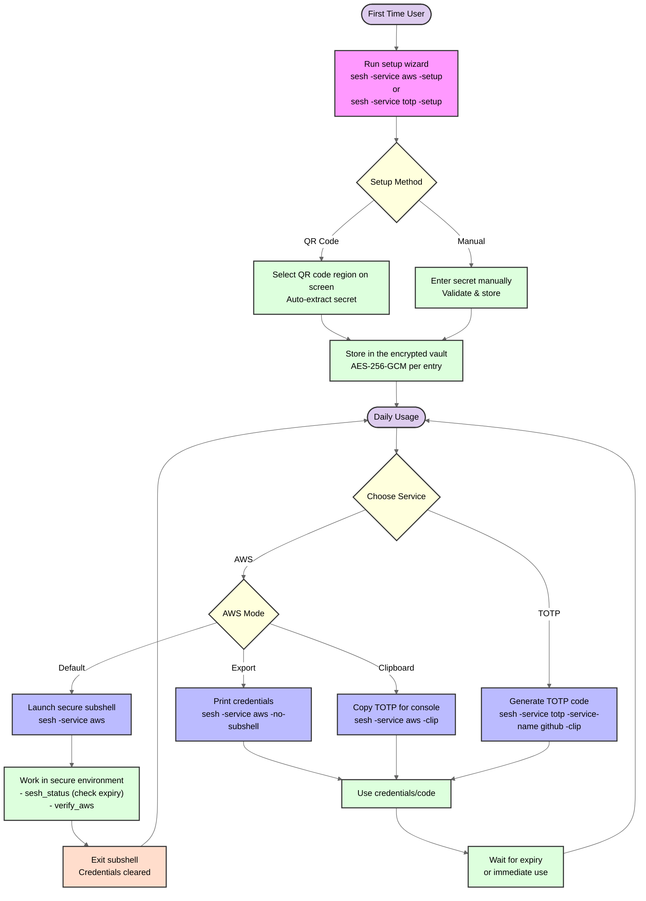
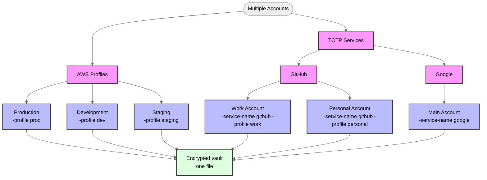

# sesh Usage and Configuration Guide

This document provides detailed instructions for using and configuring sesh for secure authentication workflows across multiple providers.

> **Requirements:** macOS or Linux. The vault, encrypted and unlocked with your master password, works the same on both; Touch ID unlock is macOS-only. For the AWS provider, the [AWS CLI](https://docs.aws.amazon.com/cli/latest/userguide/getting-started-install.html) must be installed and configured.

## Workflow Overview

The diagram below shows the complete workflow for using sesh, from initial setup through daily usage ([SVG](assets/workflow-overview.svg)):


```mermaid
%%{init: {'theme': 'neutral'}}%%
flowchart TD
    classDef start fill:#dce,stroke:#333,stroke-width:2px
    classDef process fill:#dfd,stroke:#333,stroke-width:2px
    classDef decision fill:#ffd,stroke:#333,stroke-width:2px
    classDef endNode fill:#fdc,stroke:#333,stroke-width:2px
    classDef sesh fill:#bbf,stroke:#333,stroke-width:2px
    classDef setup fill:#f9f,stroke:#333,stroke-width:2px

    Start([First Time User]):::start --> Setup["Run setup wizard<br>sesh -service aws -setup<br>or<br>sesh -service totp -setup"]:::setup
    
    Setup --> SetupChoice{"Setup Method"}:::decision
    SetupChoice -->|"QR Code"| QR["Select QR code region on screen<br>Auto-extract secret"]:::process
    SetupChoice -->|"Manual"| Manual["Enter secret manually<br>Validate & store"]:::process
    
    QR --> Vault["Store in the encrypted vault<br>AES-256-GCM per entry"]:::process
    Manual --> Vault
    
    Vault --> Daily([Daily Usage]):::start
    
    Daily --> Service{"Choose Service"}:::decision
    
    Service -->|"AWS"| AWSChoice{"AWS Mode"}:::decision
    AWSChoice -->|"Default"| Subshell["Launch secure subshell<br>sesh -service aws"]:::sesh
    AWSChoice -->|"Export"| Export["Print credentials<br>sesh -service aws -no-subshell"]:::sesh
    AWSChoice -->|"Clipboard"| AWSClip["Copy TOTP for console<br>sesh -service aws -clip"]:::sesh
    
    Service -->|"TOTP"| TOTP["Generate TOTP code<br>sesh -service totp -service-name github -clip"]:::sesh
    
    Subshell --> Work["Work in secure environment<br>- sesh_status (check expiry)<br>- verify_aws"]:::process
    Work --> Exit["Exit subshell<br>Credentials cleared"]:::endNode
    
    Export --> Use["Use credentials/code"]:::process
    AWSClip --> Use
    TOTP --> Use
    
    Use --> Expire["Wait for expiry<br>or immediate use"]:::process
    Expire --> Daily
    
    Exit --> Daily
```

## Before You Start

Have the QR code or TOTP secret ready **before** running setup:

- **For AWS MFA:** Open AWS Console → IAM → Your User → Security Credentials → MFA devices → Assign MFA device → Select "Authenticator app." AWS will display a QR code.
- **For GitHub 2FA:** Go to GitHub Settings → Password and Authentication → Enable Two-Factor Authentication → Choose "Set up using an app." GitHub will display a QR code.
- **For any TOTP service:** Navigate to the service's security/2FA settings and start the authenticator app setup flow. Look for a QR code or a base32 secret key.

Once you can see the QR code on screen, run the setup wizard.

## Basic Usage

The simplest way to use sesh is to set up a provider and start authenticating:

```bash
# First time setup for AWS (have the AWS Console QR code visible on screen)
sesh -service aws -setup

# ... or for general TOTP provider usage (have the service's QR code visible)
sesh -service totp -setup

# Daily usage - launch secure AWS subshell
sesh -service aws

# Generate and copy TOTP code for any service provider
sesh -service totp -service-name github -clip
```

This will:

1. **For AWS**: Launch a secure subshell with temporary credentials activated and MFA authenticated
2. **For TOTP**: Generate a 6-digit code with time remaining and copy it to clipboard (with `-clip`) for immediate pasting into web forms

sesh replaces mobile and desktop authenticator apps like Authy and Google Authenticator. It works with any service that supports the standard TOTP protocol (RFC 6238).

When assessing what will work with sesh, look for these signs:
- "Works with Google Authenticator" ✅
- Shows a QR code during setup ✅
- Offers "manual entry" option ✅
- Mentions "TOTP" or "RFC 6238" ✅
- Says "enter 6-digit code" ✅

Potential red flags for compatibility are the same one would face with Authy or Google Authenticator:
- "SMS only" ❌
- "Use our app only" ❌
- "Push notification required" ❌

## Shell Completion

sesh can complete its commands, flags, and their values when you press Tab, in bash, zsh, and fish. `sesh completion bash`, `sesh completion zsh`, or `sesh completion fish` prints the script for that shell; your shell needs to load it. Shell setups vary a lot (dotfiles managers, `ZDOTDIR`, plugin managers, frameworks), so below is what each shell needs, with the usual places as examples. Put it wherever your setup keeps such things.

There are two ways, for every shell:

- **Load it at startup**, with a line in a file your interactive shell reads. It's always in step with the installed sesh, at the cost of running sesh once per new shell.
- **Save it as a file** where your shell looks for completions. Nothing runs at startup. If a sesh upgrade ever changes the script, save it again. (The candidates themselves always come from the installed sesh, so new flags and values show up without that.)

**zsh**
- At startup: `eval "$(sesh completion zsh)"`, placed **after** your setup runs `compinit`. That's usually in `.zshrc`: `~/.zshrc`, or `$ZDOTDIR/.zshrc` if you set `ZDOTDIR`. Frameworks such as Oh My Zsh run `compinit` for you when they're sourced.
- As a file: save it as `_sesh` in a directory that's on your `fpath` **before** `compinit` runs, for example `sesh completion zsh > ~/.zfunc/_sesh` with `fpath=(~/.zfunc $fpath)` earlier in your config. `print -l $fpath` shows the directories. If you cache completions (`compinit -C`, or a `.zcompdump` that isn't rebuilt), delete the `.zcompdump` once so zsh notices the new file.

**bash**
- At startup: `eval "$(sesh completion bash)"` in the file your interactive bash reads. That's usually `~/.bashrc`; note that macOS Terminal starts login shells, which read `~/.bash_profile` instead (many setups source one from the other). Works with macOS's bash 3.2 and with newer bash.
- As a file: with the bash-completion package (version 2, which needs bash 4.2 or later), save it as `sesh` in its user directory, by default `~/.local/share/bash-completion/completions/sesh`. It loads on the first Tab after `sesh`.

**fish**
- At startup: `sesh completion fish | source`, in `config.fish` or a file in `conf.d/` (under `~/.config/fish/` by default).
- As a file: `sesh completion fish > ~/.config/fish/completions/sesh.fish`, or the `completions` directory under your fish config directory if you've moved it. fish loads it on the first Tab after `sesh`.

What completes:
- the commands (`agent`, `completion`, `config`, `init`, `touchid`) and theirs (`sesh agent st<Tab>` → `status`, `stop`);
- flags, including each provider's own once `--service` is given (`sesh --service password --<Tab>`);
- values from a fixed set: providers, `--action`, `--format`, `--sort`, `--entry-type`, and `--on-conflict`;
- file paths for `--file` and `--db-path`.

Entry names (`--service-name`) don't complete: that would mean opening the vault on a Tab press. Completion never reads the vault, the agent, or the config file.

## Configuration Methods

sesh uses a provider-based configuration system:

1. **Global flags** - Apply to all providers (e.g., `-service`, `-help`)
2. **Provider-specific flags** - Apply only to the selected provider (e.g., `-profile` for AWS)
3. **Config file** - Persistent settings in `~/.config/sesh/config.toml` (see [Configuration file](#configuration-file))
4. **Environment variables** - Override the config file for one shell or one command (e.g. `SESH_DB_PATH`)
5. **Credential storage** - An encrypted vault, unlocked with your master password

### Configuration file

sesh reads `~/.config/sesh/config.toml` on macOS and Linux (`$XDG_CONFIG_HOME/sesh/config.toml` when `XDG_CONFIG_HOME` is set). The file is optional, and every setting in it is optional:

```toml
db_path           = "~/vaults/sesh.db"  # where your vault lives: absolute, or starting with ~/
clipboard_timeout = "30s"               # how long a copied secret stays on the clipboard

[agent]
idle_timeout = "10m"                    # 0 disables
max_lifetime = "8h"                     # 0 disables

[audit]
retention_days = 90                     # days of audit log events to keep; 0 keeps everything

[master_password]                       # how hard your master password is to guess-check (Argon2id)
memory = "256MiB"                       # memory each check takes: 19MiB to 1GiB
time = 3                                # passes over that memory: 2 to 10
threads = 4                             # 1 to 16
```

The `master_password` settings make each guess at your master password cost an attacker memory and time; higher is slower for them, and for you at each unlock. They're stored in the vault when it's created, and each `sesh --rekey` stores the ones configured then, so changing them affects a vault only from its next password change, and never stops it from opening. Encrypted exports use them too, and record them in the file. The least sesh accepts is OWASP's minimum for Argon2id (19 MiB, 2 passes, 1 thread).

sesh keeps one vault per user. `db_path` says where that vault lives; it isn't a way to keep several. To keep things apart inside it, use profiles (`--profile work`) and service names. If you do make a second vault, give it its own folder: Touch ID unlock is kept per folder. sesh refuses a `db_path` that points at another program's SQLite database, and leaves that file unchanged.

Each setting comes from, highest first: a command-line flag (`--db-path`; the agent's timeouts also have `sesh agent` flags), its environment variable, the config file, then the built-in default. An unknown key or an invalid value is an error that names the setting and where it came from. A typo is never silently ignored.

`sesh init` writes the file for you. It's optional: with no config file, sesh uses an encrypted vault in the default location. It asks where the vault goes, then creates it, so setup ends ready to use:

```
$ sesh init
Vault location [~/Library/Application Support/sesh/passwords.db]: ~/vaults/sesh.db
Creating your sesh vault (first run)
  ...
Create master password: ****
Confirm master password: ****
Wrote ~/.config/sesh/config.toml
Ready. Run `sesh config` to see your settings.
```

- For scripts, give the location as a flag: `sesh init --db-path ~/vaults/sesh.db`. The master password for the new vault then comes from `SESH_MASTER_PASSWORD`.
- An existing config file is never replaced without `--force`.
- A new vault gets the `master_password` settings from `SESH_KDF_*`, or the defaults: the file init writes doesn't set them, so the vault matches what `sesh config` shows afterwards. Add them to the file later and run `sesh --rekey` to apply them.
- An existing vault at the chosen location is opened, not recreated. If it can't be opened (it's damaged, say), init stops and writes nothing.

`sesh config` prints each effective setting and where it came from:

```
config file: /Users/me/.config/sesh/config.toml

clipboard_timeout        30s           (default)
agent.idle_timeout       25m           (config file)
agent.max_lifetime       8h            (default)
audit.retention_days     90 days       (default)
master_password.memory   256MiB        (default)
master_password.time     3             (default)
master_password.threads  4             (default)
db_path                  /Users/me/vaults/sesh.db
                         (config file)
```

## Configuration Options

### Global Options

| Command Flag       | Description                                        | Available For    |
|--------------------|----------------------------------------------------|------------------|
| `-list-services`  | List all available service providers               | Global           |
| `-version`         | Display version information                        | Global           |
| `-help`           | Show help (use with -service for provider help)  | Global           |
| `-service`        | Service provider to use (aws, totp, password) [REQUIRED] | All commands     |
| `-list`           | List entries for selected service                  | All providers    |
| `-delete <id> …`  | Delete one or more entries, all or none; asks first unless `-force` | All providers    |
| `-setup`          | Run interactive setup wizard                       | All providers    |
| `-clip`           | Copy generated code to clipboard                   | All providers    |
| `--db-path <path>` | Vault location for this command (overrides `SESH_DB_PATH` and the config file) | Global |


### AWS Provider Options

| Command Flag       | Environment Variable | Description                             | Default Value    |
|--------------------|----------------------|-----------------------------------------|------------------|
| `-profile`        | `AWS_PROFILE`        | AWS profile to use                      | default profile  |
| `-no-subshell`    | n/a                  | Print credentials instead of subshell   | false (subshell) |
| `-force`          | n/a                  | Delete without asking                   | false            |
| `-folder`         | n/a                  | With `-setup`: folder to file the entry in; with `-list`: only entries in it and its subfolders (`""`: in no folder) | none |
| `-tag`            | n/a                  | With `-setup`: tag to add; with `-list`: only entries with it; repeat for more | none |

**Profile precedence:** `-profile` flag > `$AWS_PROFILE` environment variable > `"default"`. If neither flag nor env var is set, sesh uses the profile named `"default"`.

### TOTP Provider Options

| Command Flag       | Description                                        | Required         |
|--------------------|----------------------------------------------------|------------------|
| `-service-name`   | Name of service (github, google, slack, etc.)      | Yes              |
| `-profile`        | Profile name for multiple accounts (work, personal)| No               |
| `-force`          | Delete without asking                              | No               |
| `-folder`         | With `-setup`: folder to file the entry in; with `-list`: only entries in it and its subfolders (`""`: in no folder) | No |
| `-tag`            | With `-setup`: tag to add; with `-list`: only entries with it; repeat for more | No |

### Password Provider Options

| Command Flag       | Description                                        | Required         |
|--------------------|----------------------------------------------------|------------------|
| `-action`         | Action: store, get, generate, search, export, import, totp-store, totp-generate | Depends on use |
| `-service-name`   | Service name                                       | For store/get    |
| `-username`       | Username for the service                           | No               |
| `-entry-type`     | Filter: password, api_key, totp, secure_note       | No               |
| `-query`          | Search query                                       | For search       |
| `-format`         | Output format for get/search: table (default), json. For export/import: json (default), csv, encrypted | No               |
| `-show`           | Display password instead of clipboard hint         | No               |
| `-file`           | File path for export/import (default: stdout/stdin)| No               |
| `-on-conflict`    | Import conflict: skip, overwrite (default: error)  | No               |
| `-force`          | Skip confirmation prompts                          | No               |
| `-length`         | Generated password length (default 24)             | No               |
| `-no-symbols`     | Exclude symbols from generated passwords           | No               |
| `-sort`           | Sort by: service, created_at, updated_at, folder   | No               |
| `-limit`          | Limit number of results; 0 (the default) means no limit, and a negative value is refused | No               |
| `-offset`         | Skip the first N results; a negative value is refused | No               |
| `-folder`         | With store, generate, totp-store: folder to file the entry in. With `-list`, search, export: only entries in it and its subfolders (`""`: in no folder) | No |
| `-tag`            | With store, generate, totp-store: tag to add. With `-list`, search, export: only entries with it. Repeat for more | No |

### Environment Variables

| Variable                | Description                                        | Default          |
|-------------------------|----------------------------------------------------|------------------|
| `AWS_PROFILE`          | Default AWS profile                                | `default`        |
| `SESH_DB_PATH`         | Vault location (config: `db_path`) | `~/Library/Application Support/sesh/passwords.db` (macOS), `$XDG_DATA_HOME/sesh/passwords.db` (Linux) |
| `SESH_CLIPBOARD_TIMEOUT` | How long a copied secret stays on the clipboard (config: `clipboard_timeout`) | `30s` |
| `SESH_MASTER_PASSWORD` | Non-interactive master password (skips prompt). Intended for CI/scripting only — exposes the password via process environment | unset            |
| `SESH_AUTH_SOCK`       | Socket path for the sesh agent | `<user-cache-dir>/sesh/agent.sock` |
| `SESH_AGENT_IDLE_TIMEOUT` | Agent locks after this long without use; `0` disables (config: `agent.idle_timeout`). Same as `sesh agent --idle-timeout` | `10m` |
| `SESH_AGENT_MAX_LIFETIME` | Agent locks this long after each unlock; `0` disables (config: `agent.max_lifetime`). Same as `sesh agent --max-lifetime` | `8h` |
| `SESH_AUDIT_RETENTION_DAYS` | Days of audit log events the vault keeps; `0` keeps everything (config: `audit.retention_days`) | `90` |
| `SESH_KDF_MEMORY` | Memory for each master password check, such as `256MiB` (config: `master_password.memory`) | `256MiB` |
| `SESH_KDF_TIME` | Passes over that memory (config: `master_password.time`) | `3` |
| `SESH_KDF_THREADS` | Threads (config: `master_password.threads`) | `4` |

## The Vault and Its Key

Every secret lives in one encrypted vault file (SQLite, each entry encrypted with AES-256-GCM). Its key is derived from your master password via Argon2id, with the salt and settings kept in the vault file too, so the vault is that one file. It works the same on macOS and Linux. `sesh --rekey` changes the master password.

### Using the master password

```bash
# First run — explains what it's creating, then asks for the new password twice
sesh --service password --action store --service-name github --username alice
# Creating your sesh vault (first run)
#   Location: ~/Library/Application Support/sesh/passwords.db
#   Your master password encrypts everything in the vault. sesh can't
#   reset it: if you forget it, only a recovery key opens the vault ...
# Create master password: ****
# Confirm master password: ****
# Make a recovery key, in case you forget your master password? [Y/n]
# Unlock with Touch ID instead of typing your password? [Y/n]     (macOS)
# Enter password for github (alice): ****

# Later runs — no prompt while the agent is unlocked
sesh --service password --list

# After the agent has locked itself (10 minutes unused) — one prompt, then quiet again
sesh --service password --list
# Master password: ****
```

A new master password (at first run, `sesh --rekey`, or `sesh recover`) must be at least 8 characters, and is rated the way stored passwords are (see "Weak passwords"). If it's easy to guess, sesh warns and asks `Use it anyway? [y/N]`; answering no, or just pressing Enter, asks for a different one. With `SESH_MASTER_PASSWORD`, nobody can answer, so sesh only warns.

Creating the vault also unlocks the background `sesh agent` with the new password, so the next command doesn't ask again. See [Using the sesh agent](#using-the-sesh-agent) for how it starts, locks, and stops.

Secrets are limited to 1 MiB each.

Next to the encrypted entries, the vault file holds the KDF salt, the Argon2id settings, and a verification blob (not a password hash): nothing secret, and everything needed to unlock it with your password. With no sesh command running, copying `passwords.db` (and its `-wal` file, if a crash left one) copies everything your master password, or your recovery key, needs to open the vault.

#### Scripts and CI

For non-interactive use, set `SESH_MASTER_PASSWORD`. sesh then checks that password on every run, prints no first-run explanation, and doesn't use the agent, so a script never starts a background process or depends on one being unlocked. If you also use sesh interactively, your agent is unaffected; `sesh agent stop` still stops it if you want it gone. Because the variable exposes the password to the process environment, use it only where that's acceptable.

```bash
export SESH_MASTER_PASSWORD='...'
sesh --service password --list
```

#### Forgotten master password

sesh can't reset it for you: the master password derives the vault's key, sesh doesn't store it, and there's no server that could help. After three wrong attempts at a terminal, sesh says so and points to your options:

- **Use your recovery key**, if you made one (see [Recovery key](#recovery-key)). `sesh recover` asks for it, then for a new master password, and re-encrypts the vault:

  ```bash
  sesh recover
  ```

- **Restore from an encrypted export**, if you made one. Start a new vault (below), then import the export. It asks for the export's own password, which you chose when exporting:

  ```bash
  sesh --service password --action import --format encrypted --file backup.enc
  ```

- **Start over with an empty vault.** First stop the agent with `sesh agent stop`, and finish any other sesh command. Then move the vault aside **with every file that belongs to it**:
  - the database;
  - its SQLite `-wal` and `-shm` files, if present. After a crash they can hold changes not yet in the database, and SQLite would apply a leftover `-wal` file to the new vault;
  - `touchid.key`, if present. It belongs to the old vault, and the new one isn't offered Touch ID while it's there.

  `sesh config` shows the vault's path. Keep the old files together, in case the password comes back to you:

  ```bash
  cd ~/Library/Application\ Support/sesh     # Linux: ~/.local/share/sesh
  mkdir forgotten
  mv passwords.db* forgotten/
  mv touchid.key forgotten/                    # if it exists
  ```

  The next command creates a new vault. sesh never deletes a vault for you.

To avoid ending up here, make a recovery key, keep the master password somewhere safe, and make an encrypted export from time to time (see [Encrypted exports](#encrypted-exports)).

### Recovery key

A recovery key is a code you write down when you set it up, like `7P1J-V5ED-HW31-B0KB-HF0A-R4ST-0S81`. If you forget your master password, it lets you set a new one. sesh offers to make one when it creates a vault; you can also make one at any time:

```bash
sesh recovery new       # make a recovery key (replaces an earlier one)
sesh recovery status    # does this vault have one, and since when
sesh recovery remove    # stop it from opening the vault
sesh recover            # forgot the master password? set a new one
```

**Making one.** sesh shows the key once, then asks you to type its last group. It's only saved after you do, so a key nobody wrote down never works. Store it the way you'd store a passport: on paper, away from the computer. sesh doesn't keep a copy and can't show it again.

**Using it.** `sesh recover` asks for the key (any case; dashes and spaces optional; it reads I or L as 1 and O as 0), checks it, and asks for a new master password. The vault is re-encrypted as for a password change, and Touch ID unlock keeps working. Then:
- the key you used stops working, because it's been taken out of its hiding place and typed in;
- sesh offers a new one right away. If you decline, `sesh recovery status` shows that the vault has none.

**What it means for security.** Anyone who has both your recovery key and your vault file can open the vault, with no other check, because sesh has no server to add one. That's why it's optional. It can't be guessed (128 random bits), but it can be found, so keep it away from the vault's computer. The vault keeps only the recovery key's public key and the vault key wrapped to it; without the written-down key they open nothing.

**If the key may have been seen,** run `sesh recovery remove`, then `sesh --rekey`. Removing it stops the vault from opening with it, but a backup made while it was set still would; a password change gives the vault a new key, which no old backup's recovery key opens.

**Changes that affect it.**
- **Changing your master password** (`sesh --rekey`) keeps the recovery key working, with no prompt.

### Touch ID unlock (macOS)

On a Mac with Touch ID, the agent can unlock with your fingerprint instead of your master password. When the agent has locked itself, the next command shows the macOS Touch ID sheet:

```
sesh
sesh is trying to unlock your vault.
Touch ID to allow this.
                          [ Type Password in Terminal ]
```

**Turning it on.**
- When you create a vault at a terminal (first run or `sesh init`), sesh asks once: `Unlock with Touch ID instead of typing your password? [Y/n]`.
- Otherwise, run `sesh touchid enable`. It asks for your master password if the agent is locked.
- `sesh touchid status` shows whether it's on and whether Touch ID is available here. `sesh touchid disable` turns it off.

**How it works.**
- sesh creates a key inside your Mac's Secure Enclave that only a currently enrolled fingerprint can use. The private key never leaves the chip.
- The agent wraps the vault key to it. The result is stored in `touchid.key`, next to the vault (0600).
- `touchid.key` is useless on any other Mac or without your finger.
- The unlock is immediate after the touch: the slow password key derivation doesn't run.

**Your master password still works**, and sesh falls back to it:
- **You press "Type Password in Terminal", or the fingerprint isn't recognised:** sesh asks for the master password in the terminal. The sheet itself never takes a password; in particular it doesn't accept your Mac's login password.
- **Over SSH:** sesh doesn't ask for a fingerprint, since the sheet would appear on the Mac's own screen. It asks for the master password.
- **Touch ID isn't available:** no sensor reachable (for example with the lid closed), or no enrolled fingerprint. sesh says so and asks for the master password.
- **Too many failed attempts locked Touch ID:** sesh asks for the master password until the Mac is unlocked with its password.
- **Scripts** (no terminal, or `SESH_MASTER_PASSWORD`) never wait on a fingerprint.

**Changes that affect it.**
- **Changing your master password** (`sesh --rekey`) keeps Touch ID unlock working: sesh re-wraps the new key, with no prompt.
- **Adding or removing a fingerprint** in System Settings makes the Secure Enclave key unusable for good. sesh notices before showing the sheet: it says your fingerprints changed, turns Touch ID unlock off, and asks for the master password. Turn it back on with `sesh touchid enable`.

Only a fingerprint approves the unlock. The Mac's login password and an Apple Watch don't, so the vault never becomes as weak as a different password.

### Using the sesh agent

sesh keeps the derived key in a per-user background process, `sesh agent`, so you type the password once instead of on every command. **You don't need to manage it.** sesh starts it when it's needed, it locks itself, and the only thing it asks of you is your password.

**How it runs**

1. The command that creates the vault explains what it's creating and asks for the new password twice. It then starts `sesh agent` in the background (detached from your terminal, so it outlives it) and hands it the key. A script that creates the vault with `SESH_MASTER_PASSWORD` doesn't start an agent.
2. Whenever the agent isn't running, or has locked itself, the next command that needs the key asks for the password once, starts or unlocks the agent, and hands it the key.
3. Later commands, in any terminal, don't prompt while the agent is unlocked.
4. The agent locks itself after 10 minutes without use, and 8 hours after each unlock however busy it is. It exits when it does, since a locked agent has nothing to serve; the next command starts a fresh one and prompts once. An agent that nobody unlocks (for example, you abandoned the prompt) exits after the same 10 minutes.
5. After `sesh agent stop`, a crash, or a reboot, the next command starts a fresh agent and prompts.

Runs with `SESH_MASTER_PASSWORD` set skip the agent entirely (see [Scripts and CI](#scripts-and-ci)).

**Optional controls**

None of these are needed in normal use:

| Command | When you'd use it |
|---------|-------------------|
| `sesh agent status` | See whether it's running and unlocked, and when it will lock itself |
| `sesh agent lock` | Drop the key now, for example when stepping away; the agent keeps running until the next unlock |
| `kill -USR1 <pid>` | Lock it from a script, such as a screen-lock hook (the pid is in `sesh agent status`) |
| `sesh agent stop` | Shut it down: after changing the timeouts, or while troubleshooting |

`sesh agent status` prints, for example:

```
agent: running (pid 12345)
build:          3f9a2c1b4d5e
state: unlocked
unlocked since: 2026-05-03 09:14:00 (38m ago)
last activity:  2026-05-03 09:51:48 (12s ago)
auto-lock in:   9m 48s (idle timeout)
max lifetime:   7h 22m remaining
```

**Timeouts**

Set `agent.idle_timeout` and `agent.max_lifetime` in the [config file](#configuration-file) to durations such as `30m` or `2h`; `0` disables either. The agent reads them once, when it starts. It reads the config file itself, so the values apply whichever program starts it, including an editor that doesn't load your shell profile. `SESH_AGENT_IDLE_TIMEOUT` and `SESH_AGENT_MAX_LIFETIME` override the file, but only when they're in the environment of the command that starts the agent.

- After changing them, run `sesh agent stop`; the next command starts an agent with the new values.

**After upgrading sesh**

Nothing to do. The agent reports which sesh build it runs (a hash of its executable). When a different build of sesh reaches it, after `brew upgrade`, `make install`, or a rebuild, sesh stops it, starts its own, and prompts once:

```
Restarted the sesh agent: it was running another sesh build (3f9a2c1b4d5e).
```

`sesh agent status` shows the agent's build, and says when it differs from the `sesh` you ran.

If a release changes how sesh and the agent talk to each other, the new `sesh` can't send the old agent `stop`. Until the old agent is stopped, commands prompt on every run and warn with its pid and what to do:

```
warning: sesh agent unavailable: agent protocol mismatch: agent (pid 12345) uses protocol version 1, this sesh uses 2; stop it with: kill 12345
```

Run that `kill`; the next command starts the new version.

**Troubleshooting**

- `warning: sesh agent unavailable: ...` means sesh couldn't start or reach the agent, so it prompts on every run instead. The message says why; if the agent itself refused to start (for example because the process hardening described in [Sesh agent](SECURITY_MODEL.md#sesh-agent) couldn't be applied), it includes the agent's own log line.
- The agent's log is `~/Library/Caches/sesh/logs/agent.log` on macOS and `~/.cache/sesh/logs/agent.log` on Linux (`$XDG_CACHE_HOME/sesh/logs/agent.log` if set). Each line starts with a timestamp. It records start and stop (and why), unlocks and wrong-password attempts, locks (automatic, `sesh agent lock`, or SIGUSR1), refused connections, and errors. It never records passwords, keys, or secrets. Once it passes 1 MiB, the next agent start moves it to `agent.log.1` and begins a new one.
- To see errors directly, run the agent in the foreground: `sesh agent stop`, then `sesh agent` (Ctrl-C to stop). It accepts `--idle-timeout`, `--max-lifetime`, and `--socket`.
- The socket is `~/Library/Caches/sesh/agent.sock` on macOS and `~/.cache/sesh/agent.sock` on Linux. `SESH_AUTH_SOCK` overrides the path; if you set it, set it for every sesh command. A socket's path can be at most 103 characters on macOS and 107 on Linux. If yours is longer, for example because the cache folder is nested deep, sesh says so and works without the agent; set `SESH_AUTH_SOCK` to a shorter path, in a folder only you can write to.
- For a bug report, check that the agent answers on its socket. Each request gets one JSON line back, `hello_ack` then `pong`:

  ```bash
  printf '{"type":"hello","version":2}\n{"type":"ping","version":2}\n' | nc -U ~/Library/Caches/sesh/agent.sock
  ```

**Turning it off**

There is nothing installed to remove. `sesh agent stop` shuts it down, and the next command that needs the vault starts it again.

### The audit log

The vault records every read, store, and delete of an entry: when it happened, what kind of event it was (`access`, `modify`, `delete`), and which entry, named the way `--list` names it. It never records the secret itself.

`sesh audit` shows the newest 50 events, newest first; `--limit 100` shows more, and `--limit 0` shows them all:

```
$ sesh audit
Audit log: 1,204 events since 2026-07-05 09:12. Events older than 90 days are removed automatically (audit.retention_days).

2026-10-03 14:39:32  access  totp         github (work)
2026-10-03 14:38:10  access  aws          default
2026-10-03 14:37:18  access  password     github (alice)
2026-10-03 14:37:18  modify  password     github (alice)
...
```

Like `--list`, it opens the vault, so it asks for your master password unless the agent is unlocked.

**How long events are kept.** Each command that opens the vault removes events older than `audit.retention_days` (default `90`). Set it to `0` to keep everything. Either way, `sesh audit prune --older-than <days>` removes older events when you choose; `--older-than 0` removes them all.

Each event takes about 100 bytes, and the log's size doesn't slow sesh down, but every command writes an event, so a large vault is copied again by backup tools each time it changes. Removing events doesn't make the file smaller by itself: SQLite keeps the freed space for reuse. So `sesh audit prune` also compacts the vault and reports its size before and after. The automatic cleanup doesn't need to: it frees a little space each day, which new events reuse.

**When it grows large.** If the log passes 100,000 events (about 10 MB), whatever the retention setting, sesh prints a warning with the vault's size and how to shrink it. It shows at most once a day, and only when you're at a terminal, so scripts never see it. Typical personal use stays far below this at the default 90 days; it's meant for, say, a script that reads a secret every minute.

### Checking the vault (`sesh verify`)

`sesh verify` unlocks the vault and checks that all of it can be read:

- **The file:** SQLite's own integrity check.
- **Every entry:** its secret decrypts, and its settings (TOTP code settings, the AWS MFA device) read back. A damaged secret is otherwise found only when you read that entry, perhaps when you need it most: one flipped bit in one entry leaves the file looking fine.
- **The recovery key**, if you have one: its record is complete, well-formed, and made for the vault's current key. (Whether the wrapped key inside it is intact can only be checked with the recovery key itself.)
- **Touch ID unlock**, if it's on: it was set up for this vault and its key, and your fingerprints haven't changed since.

Each check gets one row, marked `ok`, `FAIL`, `warn`, or `-` (not set up):

```
$ sesh verify
sesh verify: ~/Library/Application Support/sesh/passwords.db

  ok    File          ok
  ok    Entries       42 entries, all readable
  ok    Recovery key  set, for this vault's key
  ok    Touch ID      on, for this vault

OK: no problems
```

When something is wrong, the rows say what, and a numbered list says what to do about each, with the commands to run:

```
$ sesh verify
sesh verify: ~/Library/Application Support/sesh/passwords.db

  ok    File          ok
  FAIL  Entries       1 of 42 entries can't be read
                        password/bank/alice: secret doesn't decrypt
                        (damaged, or encrypted with another key)
  FAIL  Recovery key  made for another vault or key
  warn  Touch ID      set up for another vault or an earlier master password

What to do
  1. Restore password/bank/alice from a backup (an encrypted export), or delete it:
       sesh --service password --delete password/bank/alice
  2. Make a new recovery key:
       sesh recovery new
  3. Optional: turn Touch ID back on:
       sesh touchid enable

FAIL: 2 problems, 1 warning
```

It names every entry it can't read, and never shows a secret. It exits 1 when the file, an entry, or the recovery key has a problem. If the file is damaged but every entry still reads, it says to export them now and start a new vault from that. A Touch ID problem is only a warning, since your password still works, so it exits 0. If the agent locks or another command changes the master password while it checks, it says to run it again rather than blaming any entry. Run it after moving or restoring the vault, after a crash, or now and then if the vault is in a synced folder. It writes nothing while it checks, then one `verify` event to the audit log (not when the file itself is damaged).

### Encrypted exports

Use `--format encrypted` to produce a portable, password-protected backup:

```bash
sesh --service password --action export --format encrypted --file backup.enc
# Encryption password: ****
# Confirm encryption password: ****
# Exported 12 entries to backup.enc

sesh --service password --action import --format encrypted --file backup.enc
# Decryption password: ****
# Imported 12 entries
```

Encrypted exports use the same Argon2id + AES-256-GCM primitives as the vault. The export is self-contained (envelope includes the salt and KDF params) and works across machines and master passwords.

Every export, encrypted or not, holds everything about each entry: its kind, service name, username, secret, times, and settings. A TOTP entry's settings (algorithm, digits, period, issuer) decide which codes are right, so they come back with it on import. In JSON they're the `settings` field; in CSV, a `settings` column holding the same JSON.

### Changing your master password (`sesh --rekey`)

`sesh --rekey` changes your master password: every entry is re-encrypted, in place, under a freshly-derived key from a new password you choose. The new password is always typed at a terminal: `SESH_MASTER_PASSWORD`, if set, gives only the current one, and without a terminal the change is refused.

```bash
sesh --rekey
# Master password: ****                          # current password
# About to change the master password and re-encrypt 12 entries in /Users/alice/Library/Application Support/sesh/passwords.db.
#
# Proceed? [y/N]: y
# Create master password: ****                   # new password
# Confirm master password: ****
# Rotated 12 entries under a new master password.
```

Behaviour:

- **All or nothing.** Every entry, the vault's key record and its recovery key record change in one database transaction: if anything fails, or the computer stops part way, nothing has changed. No second copy of the vault is made.
- **Your history stays.** The audit log is kept, with one `rekey` event for the change.
- **Other sesh commands.** Ones that save while the change commits wait a moment for it. One that unlocked the vault before the change finished can't save into it afterwards, or read from it: it's told the master password was changed, and to run again. If one has the vault open when the change finishes, sesh warns that the vault file on its own still holds the vault under the old password until that command ends; don't copy or back up the file until then. Another password change running at the same time is refused the same way, so neither undoes the other.
- **A new salt and the configured settings.** The new key comes from a new salt, with the Argon2id settings configured now (`master_password` in the config file), so a password change is how a vault takes up new ones. If you forget the new password, your recovery key sets another (see [Recovery key](#recovery-key)).

**A vault that has lost its key record** (only damage does this) is refused: `the vault at … holds entries but not the record its key is made from, so it can't be opened; restore it from a backup`. sesh never makes a new key for a vault that holds entries.


## Usage Patterns

### Basic Examples

```bash
# View all available options
sesh -help

# View provider-specific help
sesh -service aws -help
sesh -service totp -help

# List available providers
sesh -list-services

# Setup wizards
sesh -service aws -setup
sesh -service totp -setup
```

### AWS Development Workflow

The most efficient AWS development workflow uses sesh's subshell mode, which provides an isolated environment with automatic credential management:

```bash
$ sesh -service aws
🔍 Using MFA serial: arn:aws:iam::123456789012:mfa/your-user
🔑 Retrieved secret from the vault
Starting secure shell with aws credentials
🔐 Secure shell with aws credentials activated. Type 'sesh_help' for more information.
(sesh:aws) $

# You're now in an isolated subshell with AWS credentials set.
# Your prompt shows (sesh:aws) to indicate the active session.

(sesh:aws) $ sesh_status
🔒 Active sesh session for service: aws
⏳ Credentials expire in: 11h 58m 12s
   Session progress: [████████████████████] 99%

(sesh:aws) $ aws s3 ls
2024-01-15 12:00:00 my-bucket

# Exit when done — credentials are automatically cleared
(sesh:aws) $ exit
Exited secure shell
$
# Back to normal shell. AWS credentials are gone.
```

### AWS Console Access Workflow

For AWS Console (web) access, use clipboard mode to generate a TOTP code and copy it for pasting:

```bash
# Copy TOTP code for AWS Console login
sesh -service aws -clip

# This generates TWO consecutive codes:
# - Current time window code
# - Next time window code
# Paste whichever one works in the AWS Console
```

### TOTP Service Workflow

For general TOTP services, sesh provides a simple, secure workflow regardless of the service name:

```bash
# Copy TOTP code to clipboard for easy pasting
sesh -service totp -service-name github -clip
# Output:
#   🔐 Generating credentials for totp...
#   🔑 Retrieving TOTP secret for github
#   ✅ TOTP code copied to clipboard in 0.04s
#   Current: 482901  |  Next: 139847  |  Time left: 22s
#   🔑 TOTP code for github

# Print the code: alone on stdout (status goes to stderr), so it can be captured
code=$(sesh -service totp -service-name github)

# Use profiles for multiple accounts
sesh -service totp -service-name github -profile work
sesh -service totp -service-name github -profile personal

# List all TOTP entries
sesh -service totp -list
# Output:
#   Entries for totp:
#     NAME               TYPE  ID
#     github (personal)  totp  totp/github/personal
#     github (work)      totp  totp/github/work
#     google             totp  totp/google
```

The ID is what you pass to `-delete`.

There's one set of TOTP entries. `-service totp` and the password manager's `totp-store` / `totp-generate` work on the same ones (`-profile` and `-username` mean the same thing), so an entry added either way shows up in both, in search, and in exports. The AWS provider's MFA secret for a profile is the TOTP entry `aws` with the profile as its username, and it remembers the MFA device with it.

### Password Manager Workflow

The password provider stores and retrieves passwords, API keys, TOTP secrets, and secure notes:

```bash
# Generate a password, store it, copy to clipboard
sesh -service password -action generate -service-name github -username alice -clip

# Generate without symbols, custom length
sesh -service password -action generate -service-name stripe -username alice -no-symbols -length 32

# Store a password manually (prompts for input securely). An easy-to-guess
# password is stored with a warning and the generate command to replace it.
sesh -service password -action store -service-name github -username alice

# Retrieve and show
sesh -service password -action get -service-name github -username alice -show

# Copy to clipboard
sesh -service password -action get -service-name github -username alice -clip

# Store an API key
sesh -service password -action store -service-name stripe -username admin -entry-type api_key

# Store and generate TOTP codes
sesh -service password -action totp-store -service-name github -username alice
sesh -service password -action totp-generate -service-name github -username alice
sesh -service password -action totp-generate -service-name github -username alice -clip   # copy the code

# Search across all entries: see "Searching" below
sesh -service password -action search -query github
# Output:
#   Found 2 entries matching "github":
#     NAME    USER   KIND      UPDATED
#     github  alice  totp      2026-10-04 19:47
#     github  alice  password  2026-10-04 19:41

# List with filters
sesh -service password -list -entry-type api_key -sort updated_at

# Export all entries (plaintext — local use only)
sesh -service password -action export -file backup.json
sesh -service password -action export -format csv -file backup.csv

# Encrypted export (portable, password-protected with Argon2id + AES-256-GCM)
sesh -service password -action export -format encrypted -file backup.enc
# → prompts for password twice (confirmation)

# Import entries
sesh -service password -action import -file backup.json
sesh -service password -action import -file data.csv -format csv -on-conflict skip

# Import encrypted backup
sesh -service password -action import -format encrypted -file backup.enc
# → prompts for password

# JSON output for scripting
sesh -service password -action search -query stripe -format json
```

Values you ask for (a secret with `-show`, a TOTP code from `totp-generate`, and `-format json` output) go to stdout, and status messages go to stderr, so they can be captured or piped:

```bash
token=$(sesh -service password -action get -service-name stripe -entry-type api_key -show)
code=$(sesh -service password -action totp-generate -service-name github -username alice)
sesh -service password -action get -service-name github -username alice -format json | jq -r .password
```

#### Searching

`-action search -query <words>` looks at the two things you name an entry by: its service name and its username. It never looks at secrets.

- **Any part of a name.** `hub` finds `github`. Case doesn't matter.
- **Punctuation optional.** `mybank` finds `my-bank`, `awsconsole` finds `aws-console`.
- **Several words narrow it.** Every word has to match the name, the username, or the kind: `github alice` is GitHub as alice; `github totp` is GitHub's TOTP entry.
- **Kind words.** `password`; `totp`, `otp`, `2fa`, `mfa`; `key`, `api`, `token` (API keys); `note` (secure notes). Only the whole word counts: `pass` searches names.
- **Best matches first.** The whole name, then names starting with the word, then a later word in the name (`bank` in `my-bank`), then anywhere (`bank` in `snowbank`); then the same for usernames, then kind. Among equals, the most recently updated comes first.

| Search | Finds |
|---|---|
| `github` | `github` (every user and kind), then `github-enterprise` |
| `hub` | `github`, `github-enterprise` |
| `github alice` | `github` as `alice`, then `github-enterprise` as `alice` |
| `github totp` | GitHub's TOTP entry |
| `key` | every API key |
| `mybank` | `my-bank` |

**Output.** Results go to stdout, as a table, or as JSON with `-format json` (an empty list, `[]`, when nothing matches), so they can be piped. At a terminal, the matched letters are bold; set `NO_COLOR` to turn that off. `-entry-type` keeps one kind: `-query github -entry-type totp`.

Messages go to stderr:
- **Nothing found:** `No entries matching "gihtub". Did you mean: github?` sesh suggests close names (a letter or two off, or two letters swapped). It never mixes them into the results.
- **One match:** the command that uses it, for example `Copy it: sesh --service password --action get --service-name openai --entry-type api_key --clip`. For a TOTP entry: `Copy a code: sesh --service password --action totp-generate ... --clip`.

#### Secure notes and piped input

Secure notes accept multi-line bodies from stdin, so pipes and heredocs work:

```bash
# Pipe a note body
echo "recovery codes: ..." | sesh -service password -action store \
    -service-name backup-codes -entry-type secure_note

# Heredoc
sesh -service password -action store -service-name release-notes -entry-type secure_note <<'EOF'
line one
line two
EOF
```

The "Enter note" prompt only appears when stdin is a real terminal. With piped input, no prompt is shown — the content is consumed directly.

#### Overwriting existing entries

By default, `store`, `generate`, and `totp-store` prompt `[y/N]` if an entry already exists at the given service/username. Without a terminal nobody can answer (and for `store`, reading an answer would swallow the first line of the piped content), so sesh refuses instead:

```bash
$ echo "new secret" | sesh -service password -action store -service-name github -username alice
❌ failed to generate credentials: entry already exists for github (alice); re-run with --force to overwrite
```

Pass `-force` to overwrite non-interactively, for example to replace a password with a newly generated one: `sesh -service password -action generate -service-name github -username alice -force`.

### Multi-Profile Management ([SVG](assets/multi-profile-management.svg))


```mermaid
%%{init: {'theme': 'neutral'}}%%
flowchart TD
    classDef profile fill:#bbf,stroke:#333,stroke-width:2px
    classDef service fill:#f9f,stroke:#333,stroke-width:2px
    classDef vault fill:#dfd,stroke:#333,stroke-width:2px

    Start([Multiple Accounts])
    
    Start --> AWS["AWS Profiles"]:::service
    Start --> TOTP["TOTP Services"]:::service
    
    AWS --> AWSProd["Production<br>-profile prod"]:::profile
    AWS --> AWSDev["Development<br>-profile dev"]:::profile
    AWS --> AWSStaging["Staging<br>-profile staging"]:::profile
    
    TOTP --> GitHub["GitHub"]:::service
    GitHub --> GHWork["Work Account<br>-service-name github -profile work"]:::profile
    GitHub --> GHPersonal["Personal Account<br>-service-name github -profile personal"]:::profile
    
    TOTP --> Google["Google"]:::service
    Google --> GoogleMain["Main Account<br>-service-name google"]:::profile
    
    AWSProd & AWSDev & AWSStaging & GHWork & GHPersonal & GoogleMain --> KC["Encrypted vault<br>one file"]:::vault
```

### Entry Management

List and manage stored entries:

```bash
# List all entries for a service
$ sesh -service aws -list
Entries for aws:
  NAME           TYPE     ID
  AWS (default)  aws mfa  totp/aws/default
  AWS (prod)     aws mfa  totp/aws/prod

# Delete an entry by copying the ID from -list output
$ sesh -service aws -delete totp/aws/prod
Delete "totp/aws/prod"? [y/N]: y
✅ Deleted 1 entry

# Delete several at once: every ID is checked first, and if any is wrong
# nothing is deleted; then sesh lists them and asks once
$ sesh -service password -delete password/old-bank api_key/old-service/ci
These entries will be deleted:
  password/old-bank
  api_key/old-service/ci
Delete these 2 entries? [y/N]: y
✅ Deleted 2 entries
```

A delete asks first, for every provider: `y` or `yes` goes ahead. `-force` deletes without asking, and is needed without a terminal, as in a script; sesh says so before asking for the master password. Flags go before the IDs: in `-delete a b -force`, `-force` would be read as an ID, and sesh says so.

To delete entries chosen by a filter, search for them as JSON (it shows each entry's `id`, never a secret), pick the IDs with `jq`, check them, then hand them to `-delete` with `xargs`. Separate the IDs with NUL characters (`jq -j … + "\u0000"` and `xargs -0`): names can contain spaces and quotes, which plain `xargs` would split on, turning one ID into others.

```bash
# every API key for old-service: check the list first, then delete it
sesh -service password -action search -query old-service -entry-type api_key -format json | jq -r '.[] | select(.service == "old-service") | .id'
sesh -service password -action search -query old-service -entry-type api_key -format json | jq -j '.[] | select(.service == "old-service") | .id + "\u0000"' | xargs -0 sesh -service password -force -delete
```

For a very long list, `xargs` runs sesh more than once, and each run is all or none on its own; check the count sesh reports.

**Names.** An entry is named by its service name and, optionally, a username (for AWS and `--service totp`, the profile). Spaces inside a name are fine (`My Bank`). sesh refuses a name with:

- a `/`, which separates the parts of an entry's ID (`password/github/alice`), or a control character such as a tab or newline;
- a space at the start or end (`"github "`), which would make an entry that `github` doesn't find;
- an invisible character (such as a zero-width space or soft hyphen, which text copied from web pages can carry) anywhere in it, for the same reason. The characters emoji are built from (zero-width joiners, the tags in flags like Scotland's) are fine inside a name;
- a character that changes text direction, which can make one name display as another;
- more than 256 characters.

The password manager's `store`, `generate`, `get` (including `--clip` on its own), `totp-store`, and `totp-generate` check names before the vault is opened, as do `--service totp` (the service name and profile), `--service aws` (the profile), and `--delete` (the entry ID), so a bad name is reported before the master password is asked for. The TOTP setup checks the service name and profile once you've entered both, the AWS setup checks the profile as soon as you enter it, and an import reports each entry it refuses and imports the rest.

Names are case-sensitive: `GitHub` and `github` are two entries. When a lookup (`get`, `totp-generate`, `--service totp`, or `--delete` with `--service password` or `--service totp`) misses only by case, sesh says which entry you may have meant. Creating an entry whose name differs from an existing one only in case asks first, like an overwrite: with `store`, `generate`, and `totp-store` (`--force` skips the question), and in the TOTP setup wizard. AWS profiles are named by your AWS configuration, so the AWS setup doesn't ask.

**Weak passwords.** When you type a password to store (`--action store`, kind `password`), sesh rates it with [zxcvbn](https://github.com/dropbox/zxcvbn), which knows common passwords, words, names, dates, and keyboard patterns, and counts the entry's own service name and username as easy guesses. If zxcvbn estimates fewer than about 100 million guesses would find it (a score of 2 or less out of 4), sesh stores it and warns, with the command to generate a strong one instead. Generated passwords, and generated API keys, get the same check: at the default length (24) they always pass, but `--length 9` or shorter can fail it, and then the warning suggests `--length 12` or more. API keys and notes you type aren't rated. zxcvbn's word lists are English: for passwords in other languages or scripts, it judges mostly by length and the mix of characters. Only a password's first 64 characters are rated.

### Folders and tags

An entry can be in one folder and have any number of tags. Folders nest with `/` (`work/aws`); tags are flat (`urgent`, `2fa`). Neither is part of the entry's ID or name: two entries with the same name can't sit in different folders.

File an entry as you store it, with `--folder` and `--tag` (repeat `--tag` for more):

```bash
sesh -service password -action store -service-name github -username alice -folder work/dev -tag urgent -tag code
sesh -service password -action generate -service-name bank -folder personal
sesh -service totp -setup -folder personal/money -tag 2fa
```

They work with the password manager's `store`, `generate`, and `totp-store`, and with `-setup` for TOTP and AWS. Storing over an existing entry with `--folder` moves it; `--tag` adds to its tags. Without either, an existing entry keeps its folder and tags.

Without the flags, the TOTP and AWS setup wizards ask at the end, and Enter skips:

```
Folder (optional, such as work/aws; Enter for none): work//x
❌ the folder "work//x" has an empty part: "/" separates folders, so it can't come first, last, or twice in a row
Folder (optional, such as work/aws; Enter for none): personal
Tags (optional, separated by spaces; Enter for none): 2fa
```

A wrong answer is asked again, since the secret has been captured by then. Setting up an entry again shows its folder and tags, and Enter keeps them.

`-list` shows FOLDER and TAGS columns when any listed entry has one:

```
$ sesh -service password -list
Entries for password:
  NAME            TYPE      FOLDER    TAGS         ID
  github (alice)  password  work/dev  code urgent  password/github/alice
  google          totp      personal  2fa          totp/google
  openai          api_key                          api_key/openai
```

With `-list`, and the password manager's `search` and `export`, the same flags narrow the entries instead: `--folder work` keeps those in `work` and its subfolders (`work/dev`, but not `workshop`), `--folder ""` those in no folder, and `--tag` those with the tag; several `--tag`s keep the entries with all of them. They work for every provider's `-list`, and combine with `-entry-type` and the search query:

```bash
sesh -service password -list -folder work -sort folder
sesh -service totp -list -tag 2fa
sesh -service password -action search -query git -folder work/dev
sesh -service password -action export -format encrypted -folder personal -file personal.enc
```

When nothing matches because the folder or a tag isn't on any of the entries looked at, sesh says so, and suggests one that differs only by case (`there's no folder "Work" (did you mean "work"?). Folders and tags are case-sensitive`). An export whose `--folder`, `--tag`, or `-entry-type` matches nothing fails instead, before `-file` is touched or a password asked for, so a typo can't empty an existing backup. Elsewhere, such as with `get` or `-delete`, sesh refuses `--folder` and `--tag` rather than ignore them; `-delete` takes entry IDs.

`-sort folder` (password manager) puts a folder's entries together: entries in no folder first, then each folder followed by its subfolders (`work`, `work/dev`, then `work-old`). Search results show FOLDER and TAGS columns too, when an entry has one. `get -format json` includes `folder` and `tags`. Exports carry them too: JSON as `folder` and `tags` (a list), CSV as `folder` and `tags` columns (tags joined with `;`), and encrypted exports with the JSON. Importing restores them, and `--on-conflict overwrite` replaces an existing entry's folder and tags with the file's.

**Changing them later.** `sesh folder` and `sesh tag` work on entries already stored, of any kind, by their IDs (what `-list` shows). Every ID is checked first: if any is wrong, nothing changes.

```
$ sesh folder move work api_key/openai
✅ Moved 1 entry to work
$ sesh tag add urgent api_key/openai totp/bank password/github/alice
✅ Tagged 2 entries urgent (1 already had it)
$ sesh tag remove 2fa totp/google
✅ Took tag 2fa off 1 entry
$ sesh folder rename personal home              # its subfolders go with it
✅ Renamed folder personal to home, on 2 entries
$ sesh tag rename urgent now
✅ Renamed tag urgent to now, on 3 entries
$ sesh folder list
Folders:
  home     1  (2 in all)
    money  1
  work     1  (2 in all)
    dev    1
$ sesh tag list
Tags:
  2fa     1
  code    1
  now     3
1 entry has no tags.
```

`sesh folder move "" <id>…` takes entries out of their folder. Renaming a folder or tag to a name already in use merges the two, and sesh says so. A folder can't be moved into a folder under itself, or renamed so that a subfolder's full name would pass 256 characters. These changes don't change an entry's update time, and each changed entry gets a `modify` event in the audit log.

Names are matched exactly, so sesh helps with case: renaming or removing a folder or tag no entry has fails, naming one that differs only by case (`there's no folder "Home" (did you mean "home"?). Folders and tags are case-sensitive`), and adding a tag or moving to a folder that differs only by case from one in use works, with a note saying so.

**Names.** A tag is letters (in any script, with their accents and vowel marks), digits, `-`, `_`, and `.`, up to 64 characters, and doesn't start with `-`, which a command would read as a flag. A folder is parts like that joined by `/`, each up to 64 characters and up to 256 in all, with no empty part (no `/` at either end or twice in a row) and no part that's only dots (`.` or `..`, which read like a path). Both are matched exactly, so `Work` and `work` differ. Like names, they're stored as plain text, not encrypted.

In CSV, spaces around a tag and empty tags (`a; b;;`) are ignored on import. If input ends at a setup wizard's folder or tag question (Ctrl-D), the entry is saved with what was answered, since the secret has been captured by then.

### Setup Wizard Features

The interactive setup wizard guides you through configuration:

```bash
# AWS Setup
sesh -service aws -setup
# - Prompts for MFA device setup in AWS Console
# - Handles QR code scanning or manual secret entry
# - Validates and stores secret securely
# - Provides test codes for AWS activation

# TOTP Setup
sesh -service totp -setup
# - Prompts for service name
# - Optional profile name for multiple accounts
# - QR code scanning: uses macOS screencapture to let you select the QR code region
# - Manual secret entry fallback if QR scanning fails or is cancelled
```

### QR Code Setup Flow

During setup, sesh offers QR code scanning as the primary method for capturing TOTP secrets:

1. **Display the QR code** on your screen (e.g., from AWS IAM, GitHub Settings, Google Account, etc.)
2. **Run the setup wizard** (`sesh -service totp -setup` or `sesh -service aws -setup`)
3. **Select the QR code region** — macOS `screencapture -i` launches, turning your cursor into a crosshair. Click and drag to select the area containing the QR code.
4. **sesh decodes the QR code** automatically, extracting the TOTP secret from the `otpauth://` URL
5. **Validation** — sesh generates test codes to verify the secret works before storing it

If QR scanning fails (e.g., QR code too blurry, wrong format, or you press Escape to cancel), sesh falls back to manual entry where you paste the base32 secret directly.

> **Supported QR codes:** Only `otpauth://totp/...` URLs (RFC 6238). This is the format used by Google Authenticator, Authy, 1Password, and most TOTP-compatible services. Non-standard parameters (SHA-256/SHA-512 algorithm, 8 digits, custom period) are automatically extracted from the QR code and stored alongside the secret, so sesh generates correct codes for services with non-default configurations.

### Troubleshooting

```bash
# Get detailed help for a provider
sesh -service aws -help
sesh -service totp -help
```

**Common issues and solutions:**

| Error | Cause | Fix |
|-------|-------|-----|
| "no AWS entry found for profile 'X'" | No credentials stored for this profile | Run `sesh -service aws -setup` |
| "no TOTP entry found for service 'X'" | No TOTP secret stored for this service | Run `sesh -service totp -setup` |
| "MultiFactorAuthentication failed" | TOTP code was recently used or expired | Wait for the next 30-second window and try again. sesh automatically retries with the next code. |
| "failed to capture screenshot" | QR scanning cancelled or failed | Press Enter to fall back to manual secret entry |
| "failed to decode QR code" | QR code blurry, too small, or not `otpauth://` format | Try manual entry instead, or retake a clearer screenshot |
| "failed to detect MFA device" | AWS CLI can't find an MFA device for the profile | Ensure an MFA device is configured in AWS IAM for this profile |
| "already in a sesh environment" | Tried to nest sesh sessions | Exit the current subshell first with `exit` or Ctrl+D |

## Environment Variables

```bash
# Set default AWS profile
export AWS_PROFILE=production
sesh -service aws  # Uses production profile

# Environment set by the subshell:
# AWS_ACCESS_KEY_ID, AWS_SECRET_ACCESS_KEY, AWS_SESSION_TOKEN
# SESH_ACTIVE=1      (useful in scripts to detect a sesh session)
# SESH_SERVICE=aws    (which provider is active)
```

## Default Behavior

When run without additional flags, sesh will:

1. **For AWS (`-service aws`)**: Launch a secure subshell with temporary session credentials (duration determined by AWS STS, typically 12 hours)
2. **For TOTP (`-service totp`)**: Display the current code with time remaining
3. **Setup Required**: First-time users must run `-setup` for each service
4. **Profile Selection**: Uses default AWS profile or requires `-service-name` for TOTP
5. **Security**: Secrets are stored in one vault file, each encrypted at rest with AES-256-GCM under a key derived from your master password
6. **Clipboard**: On macOS, values copied via `-clip` are automatically cleared after 30 seconds (only if the clipboard still holds the copied value). On other platforms no auto-clear is performed

## Subshell Behavior

The AWS subshell provides:

- **Visual Indicators**: Custom prompt showing active sesh session
- **Auto-cleanup**: Credentials cleared on exit
- **Built-in Commands**: `sesh_status`, `verify_aws`, `sesh_help`
- **Expiry Tracking**: Check remaining time with `sesh_status` (includes countdown and progress bar)
- **Shell Support**: Full support for bash/zsh, basic support for other shells

## Getting Help

If you encounter issues or have questions:

### Quick Debugging

```bash
# Check version
sesh -version

# List all stored entries
sesh -service aws -list
sesh -service totp -list

# Get provider-specific help
sesh -service aws -help
sesh -service totp -help
```

### Getting Support

1. **Check existing issues**: https://github.com/bashhack/sesh/issues
2. **Open a new issue** with:
   - Your macOS version
   - Installation method (Homebrew, go install, etc.)
   - Command that failed
   - Error message
   - Output of `sesh -version`

### Security Note

Never share TOTP secrets or AWS credentials in bug reports.

## Related Documentation

- [Security Model](SECURITY_MODEL.md) - Threat model, defense strategies, and privacy guarantees
- [Plugin Development](PLUGIN_DEVELOPMENT.md) - Guide for building new providers
- [Architecture](ARCHITECTURE.md) - Technical design and component overview
